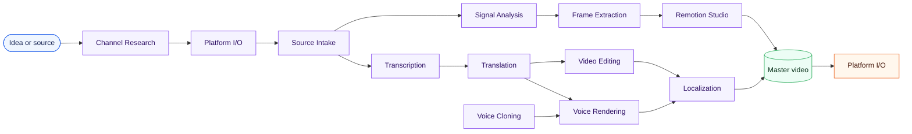
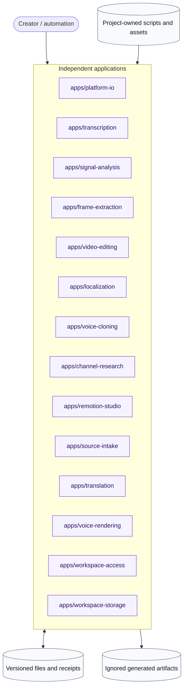

<div align="center">

# Video Production MVPs

**A Windows-first toolbox for researching, producing, localizing, rendering, and publishing video — one independent program at a time.**

[](scripts/test-all.ps1)
[](apps/README.md)
[](docs/ARCHITECTURE.md)

[Quick start](#five-minute-start) · [Applications](#choose-one-result) · [Workflows](docs/WORKFLOWS.md) · [Architecture](docs/ARCHITECTURE.md) · [Contributing](docs/CONTRIBUTING.md)

</div>

---

## One repository, seventeen focused programs

This is not one giant pipeline. Each MVP has its own launcher, installer, manifest, documentation, tests, output boundary, and delivery evidence. Use one application without learning the others; compose them through files when a larger workflow is useful.



The arrows describe useful composition, not mandatory coupling.

## Choose one result

| Program | You provide | You receive | Evidence | Guide |
|---|---|---|---|---|
| **Platform I/O** | URL or finished video | Verified download or guarded upload receipt | `DOMAIN_VERIFIED` | [Open](apps/platform-io/README.md) |
| **Source Intake** | Local folder or supported social URL | Deterministic source manifest + receipt | `DOMAIN_VERIFIED` | [Open](apps/source-intake/README.md) |
| **Creator Discovery** | YouTube/Bilibili/Douyin/TikTok creator URL | Ordered canonical video manifest | `PLATFORM_INTEGRATED` | [Open](apps/creator-discovery/README.md) |
| **Channel Research** | Platform source reference | Reproducible research dossier | `DOMAIN_VERIFIED` | [Open](apps/channel-research/README.md) |
| **Transcription** | Source manifest + ASR policy | Verified transcript manifest + JSON/SRT | `DOMAIN_VERIFIED` | [Open](apps/transcription/README.md) |
| **Translation** | Transcript manifest + target languages | Editable translation manifest + JSON/SRT | `DOMAIN_VERIFIED` | [Open](apps/translation/README.md) |
| **Voice Rendering** | Translation manifest + language voices | Verified per-segment MP3 clips + manifest | `DOMAIN_VERIFIED` | [Open](apps/voice-rendering/README.md) |
| **Signal Analysis** | Video | Cut points + loudness measurements | `IMPLEMENTED` | [Open](apps/signal-analysis/README.md) |
| **Frame Extraction** | Video + optional cuts | Frame set | `IMPLEMENTED` | [Open](apps/frame-extraction/README.md) |
| **Video Editing** | Video + edit operation | Edited derivative | `IMPLEMENTED` | [Open](apps/video-editing/README.md) |
| **Voice Cloning** | Text + reference voice | Synthesized speech | `IMPLEMENTED` | [Open](apps/voice-cloning/README.md) |
| **Remotion Studio** | Composition + project props | Preview or render | `IMPLEMENTED` | [Open](apps/remotion-studio/README.md) |
| **Localization** | Source + translation + voice manifests | Subtitle-burned H.264/AAC derivatives | `PLATFORM_INTEGRATED` | [Open](apps/localization/README.md) |
| **Publication** | Finished video + metadata + targets | Confirmable publication plan and serial receipts | `DOMAIN_VERIFIED` | [Open](apps/publication/README.md) |
| **Video Graph Studio** | Prepared folder + language + voice + target | Durable browser-managed workflow | `DOMAIN_VERIFIED` | [Open](apps/video-graph-studio/README.md) |
| **Workspace Access** | Workspace roots + short-lived scopes | Hashed credential registry + redacted authorization decision | `DOMAIN_VERIFIED` | [Open](apps/workspace-access/README.md) |
| **Workspace Storage** | Workspace ID + storage root + quota | Confined state/artifact/temp namespaces + capacity decision | `DOMAIN_VERIFIED` | [Open](apps/workspace-storage/README.md) |

## Independent by design



- Applications communicate through public CLIs and explicit files.
- No application imports another application's private implementation.
- Concrete productions remain in `projects/`; reusable behavior belongs in `apps/`.
- Models, cookies, profiles, source downloads, previews, and renders stay out of Git.

## Five-minute start

Requirements: Windows 11, PowerShell 5.1+, Python 3.12, Git, and FFmpeg. Individual applications document any additional dependencies.

```powershell
git clone https://github.com/wohuishuo/cc-video-pipeline.git
cd cc-video-pipeline

python -m venv .venv
.\.venv\Scripts\python.exe -m pip install pytest

powershell -ExecutionPolicy Bypass -File .\scripts\doctor.ps1
powershell -ExecutionPolicy Bypass -File .\scripts\test-all.ps1
```

Then install only the program you need:

```powershell
powershell -ExecutionPolicy Bypass -File .\apps\platform-io\install.ps1
powershell -ExecutionPolicy Bypass -File .\apps\platform-io\run.ps1 doctor --json
```

## Delivery evidence

Status labels describe what has been proven:

| Level | Meaning |
|---|---|
| `DESIGNED` | Boundary and behavior are specified; executable completion is not claimed. |
| `IMPLEMENTED` | Code and public entrypoint exist; real environment evidence may still be missing. |
| `DOMAIN_VERIFIED` | Domain contracts and adjacent integrations pass with recorded evidence. |
| `PLATFORM_INTEGRATED` | Real external runtime or platform behavior has been verified. |
| `PRODUCTION_VERIFIED` | Recovery, security, operations, and representative production behavior are evidenced. |

Every program has a `docs/mvp/<name>/` brief, capability DAG, evidence record, and delivery ledger. Known limits are part of the product documentation, not hidden footnotes.

## Documentation

- [Architecture and ownership](docs/ARCHITECTURE.md)
- [Project system and Graph Engineering](docs/project/README.md)
- [System blueprints and public contracts](docs/project/architecture/design/README.md)
- [Lifecycle and operations tutorial](docs/training/02-lifecycle-and-operations-verification.md)
- [Secure workspace admission tutorial](docs/training/03-secure-workspace-admission.md)
- [Creator workflows](docs/WORKFLOWS.md)
- [Contributing a new MVP](docs/CONTRIBUTING.md)
- [Repository map](docs/PROJECT_MAP.md)
- [Command guide](TOOLS.md)
- [Platform I/O details](docs/video-platform-io.md)
- [Design decisions](docs/superpowers/specs/2026-07-29-independent-video-mvp-repository-design.md)

## Safety defaults

- Downloads try anonymous access before optional cookies.
- Upload commands prepare by default; `--execute` is required to touch a platform.
- YouTube upload defaults to private unless public visibility is explicitly requested.
- A zero exit code is never treated as success when the declared output is missing.
- Credentials and browser profiles are redacted from receipts and ignored by Git.

---

<div align="center">

Built for creators who want small tools they can understand, verify, replace, and reuse.

</div>
