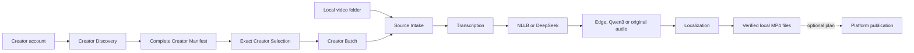

# Creator Workflow Studio

Creator Workflow Studio is a local-first browser application for turning a creator account or a folder of videos into translated, voiced local MP4 files. Upload routes are optional. The browser coordinates independently runnable capability MVPs; it does not absorb their manifests, checkpoints, or state ownership.

## Start

```powershell
powershell -NoProfile -ExecutionPolicy Bypass -File apps/video-graph-studio/run.ps1
```

Studio opens [http://127.0.0.1:8765](http://127.0.0.1:8765) and binds only to loopback. Use `-NoBrowser` to reuse an existing tab. The default data root is `%LOCALAPPDATA%\VideoGraphStudio`, and the default delivery root is the user's existing `Videos` folder.

## Seven-stage workflow

1. **Source** — choose a YouTube, Bilibili, Douyin or TikTok creator catalog, or an existing local folder. Retrying **Load all videos** reuses the authentication-file reference from the last successful discovery run.
2. **Videos** — inspect the exact account catalog and select any subset, or inspect every supported file in the local folder. An incomplete catalog remains visibly marked; after an explicit acknowledgement, its exact discovered items may still be processed without claiming that the account is complete.
3. **Translation** — choose one or many of 20 locales and explicitly select NLLB local or DeepSeek cloud translation.
4. **Voice** — independently choose Edge TTS, Qwen3-TTS preset synthesis, or original audio with translated subtitles. Voice choices are validated per locale.
5. **Output** — choose an allowed local directory. Local MP4 delivery is sufficient; YouTube, Bilibili, Douyin and TikTok routes are collapsed under an optional section.
6. **Review** — verify exact source-video, localized-video and optional-publication counts before execution.
7. **Activity** — follow durable owner steps and logs. Processing is serial and completed checkpoints remain reusable.

There is no decorative infinite canvas, fake connection port, hidden node insertion or mandatory platform selection.

## Creator catalog recovery

Creator Discovery uses platform adapters and pagination; it does not depend on browser scrolling. Studio stores only the local authentication-file path in run parameters and restores that path when the last successful catalog is reopened. Cookie contents stay outside browser state and capability receipts.

If a platform cannot return a complete catalog, Studio preserves two honest recovery paths:

1. Retry **Load all videos** with `maxItems=0` and the restored authentication-file reference.
2. Enable **Process only the currently loaded videos**, choose exact video IDs and continue to translation, voice and local output. The resulting request carries `allowPartialCatalog: true`; the source catalog remains `complete=false` and `truncated=true`.

Omitting explicit consent still rejects an incomplete catalog at the API boundary.

## Provider policy

Translation and voice are separate choices:

| Capability | Providers | Runtime boundary |
| --- | --- | --- |
| Translation | NLLB, DeepSeek | NLLB is local; DeepSeek requires `DEEPSEEK_API_KEY` in the server environment |
| Voice | Edge TTS, Qwen3-TTS, original audio | Edge uses named network voices; Qwen3 uses one resident local model per process; original preserves source audio and burns translated subtitles |

DeepSeek and Qwen3 readiness is projected by versioned endpoints without exposing credentials. Qwen3 currently uses preset voices, not voice cloning.

## Capability composition



Creator Discovery owns account enumeration. Creator Selection owns the exact selected IDs. Creator Batch owns serial cross-item continuation. Translation, Voice Rendering and Localization own their own outputs. Studio owns admission and projections only.

## Local folders and OneDrive

The folder browser permits only configured roots. The default local launch includes existing `Videos`, `Documents`, `Downloads` and `Desktop` directories under both the user profile and `OneDrive`. It lists exact video paths and sizes without moving or deleting source files.

## Publication boundary

No platform is required for a valid run. Zero destination routes means “produce local files only.” YouTube remains a separately confirmed private-upload path; Bilibili, Douyin and TikTok remain plan-only until their authenticated execution adapters are independently verified. The ordinary local-processing button never silently publishes.

## Durable execution

Starts enter a SQLite-backed FIFO queue. Exactly one workflow and one child process execute at a time. Restart fences abandoned `RUNNING` steps as `INTERRUPTED` and resumes from the first missing checkpoint. Press `Ctrl+C` to stop the server without deleting committed artifacts.

## Verify

```powershell
tools\.venv\Scripts\python.exe -m pytest --import-mode=importlib tests\video_graph_studio tests\voice_rendering_mvp tests\creator_batch_mvp tests\localization_mvp -q
node --test tests/video_graph_studio/*.test.mjs
```

See [the local-first browser drill](../../docs/project/evidence/video-graph-studio/local-first-creator-workspace-drill.md) for the tested UI facts and current evidence boundary.

## Current evidence boundary

- Strict incomplete-catalog rejection, explicit partial-catalog consent, authentication-file recovery, local-folder inventory, provider selection, zero-route local delivery, responsive layout and versioned payloads are domain verified.
- The browser drills proved both a four-file local preflight and a three-item partial-catalog preflight. A live Douyin retry then reused the saved authentication-file reference and enumerated all 75 videos. Expensive media rendering was deliberately not started.
- Edge and Qwen3 provider adapters are domain tested. Qwen3 first-model startup can be slow; no cloned-voice claim is made.
- DeepSeek is tested at a deterministic HTTP boundary; no paid request is claimed.
- Authenticated public uploads, remote hosting, production multi-tenancy, mobile packaging and representative load remain unproven.
