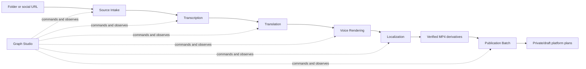

# Video Graph Studio

Video Graph Studio is a local browser control plane for reusable video MVPs. It provides a ComfyUI-style workflow canvas while keeping workflow continuation, localization media and platform receipts under separate owners.

## Start

```powershell
powershell -NoProfile -ExecutionPolicy Bypass -File apps/video-graph-studio/run.ps1
```

The launcher opens `http://127.0.0.1:8765`. It never binds to the LAN. The browser first loads the canonical Client Contracts bundle from `GET /api/v1/contracts`, then uses that discovered version for every command. To run without opening a browser:

```powershell
powershell -NoProfile -ExecutionPolicy Bypass -File apps/video-graph-studio/run.ps1 -NoBrowser -Port 8765
```

The ordinary loopback launch stays credential-free. To admit one configured workspace, first initialize Workspace Access and issue a short-lived browser credential with `runs:read`, `runs:write` and `artifacts:read`, then start Studio with the registry and workspace ID:

```powershell
$registry = "$env:LOCALAPPDATA\VideoGraphStudio\workspace-access.json"

powershell -NoProfile -ExecutionPolicy Bypass -File apps/video-graph-studio/run.ps1 `
  -AccessRegistry $registry `
  -WorkspaceId local
```

Use the **Access** button to enter the workspace ID and bearer credential. The browser keeps them in `sessionStorage`, attaches them to versioned API requests, and removes bootstrap credentials from the URL fragment immediately. Static assets, health and contract discovery remain public; run queries require `runs:read`, folder browsing requires `artifacts:read`, and mutations require `runs:write`. The server also limits browsing to that workspace's configured roots.

This protects the local HTTP boundary but is not multi-tenant hosting: each secure Studio process serves exactly one workspace and one data root. Tenant-scoped storage, remote identity, vault custody and audit export remain later owners.

## Route multiple local workspaces

After provisioning the same workspace IDs in both Workspace Access and Workspace Storage, one loopback Studio process can route each authenticated request into separate state and artifact namespaces:

```powershell
powershell -NoProfile -ExecutionPolicy Bypass -File apps/video-graph-studio/run.ps1 `
  -AccessRegistry "$env:LOCALAPPDATA\VideoGraphStudio\workspace-access.json" `
  -StorageRegistry "$env:LOCALAPPDATA\VideoGraphStudio\workspace-storage.json"
```

Do not pass `-WorkspaceId` in this mode. The browser's workspace field selects the requested workspace, Workspace Access authorizes that exact ID, and Workspace Storage supplies its state/artifact roots. Each workspace gets a lazily created SQLite database and durable FIFO queue. All workspace engines share one execution gate, so the entire local process still runs at most one workflow and one child process at a time; FIFO order is preserved inside each workspace, while order between workspace queues is intentionally unspecified.

This is evidence-backed local separation, not production multi-tenancy. The registries are local JSON files without cross-process locking, the capacity check is a serial preflight rather than a hard reservation, and the server remains loopback-only.

## Enforce a local resource budget

Resource enforcement is optional and composes the independent Resource Budget program through its public launcher. First configure a budget for every workspace that Studio may run:

```powershell
$budget = "$env:LOCALAPPDATA\VideoGraphStudio\resource-budget.db"
powershell -NoProfile -ExecutionPolicy Bypass -File apps/resource-budget/run.ps1 configure `
  --database $budget --workspace-id local --byte-limit 10737418240 `
  --execution-slots 1 --json

powershell -NoProfile -ExecutionPolicy Bypass -File apps/video-graph-studio/run.ps1 `
  -ResourceBudgetDatabase $budget `
  -ResourceReservationBytes 1073741824 `
  -ResourceLeaseTtlSeconds 30
```

Use the admitted workspace IDs instead of `local` in fixed or multi-workspace mode. A queued run consumes no lease. Immediately before it enters `RUNNING`, Studio reserves the configured byte estimate and one execution slot under the stable identity `studio-<run-id>`. Capacity denial leaves the run durably queued. The worker renews while active and releases after completion, failure or cancellation; restart reconciliation releases stranded terminal leases and reacquires interrupted work by the same identity.

The byte value is an operator estimate, not measured output truth. Workspace Storage still owns actual disk usage, and writers outside Resource Budget can consume disk. This is local SQLite enforcement, not distributed quota, billing or production scheduling.

Choose one of the workflow templates:

- `Folder` or `URL` creates and verifies a Source Manifest.
- `Folder+ASR` or `URL+ASR` continues through a verified Transcript Manifest.
- `Folder+Translate` or `URL+Translate` continues through editable RU/EN/KK translation JSON/SRT.
- `Folder+Voice` or `URL+Voice` continues through verified per-segment Edge MP3 clips.
- `Folder+Dub` or `URL+Dub` runs all ten owner steps and produces verified subtitle-burned H.264/AAC derivatives.
- `Folder+Release` or `URL+Release` adds Publication Batch after those ten steps and prepares a verified private/draft plan for every localized derivative and selected platform. It never uploads.
- `Creator` enumerates a YouTube/Bilibili/Douyin/TikTok profile into a verified Creator Manifest without downloading media.
- `Creator+Dub` enumerates the profile, then uses the independent Creator Batch owner to download, transcribe, translate, synthesize and localize exactly one video at a time with resumable item checkpoints.
- `Publish Plan` fingerprints one finished video and metadata file into private/draft jobs for selected platforms. It never uploads.
- `Publish Execute` resolves one completed private YouTube plan from the same workspace and requires its exact SHA-256 plus a Credential Vault path before invoking guarded execution. It is a separate explicit Graph.
- `Connect YouTube` opens the system browser for desktop OAuth, stores the refresh credential through Credential Vault and independently verifies the active provider-bound fact. OAuth secrets never enter Studio state.
- `Localize` runs the compatibility prepared-folder Edge workflow.

Submit several workflows without waiting for the previous one to finish. Start requests are stored in a durable FIFO queue while exactly one workflow and one child process execute at a time. The Inspector's Queue & Recent list lets you reopen and monitor recent runs. The ten-step dubbing graph calls Source Intake, Transcription, Translation, Voice Rendering and Localization only through their public launchers.



## Stop

Press `Ctrl+C` in the launcher terminal. The server requests cancellation for its active child, closes the HTTP listener and leaves completed checkpoints and queued start requests intact. After an unexpected process loss, restart fences an abandoned `RUNNING` step as `INTERRUPTED`, requeues the abandoned queue claim and resumes queued work from the first missing checkpoint.

## Data root

The default data root is `%LOCALAPPDATA%\VideoGraphStudio`. Override it with `-DataRoot C:\path\to\studio-data`. `studio.db` owns graph run state, durable start order and logs. Each capability keeps its artifacts below its own data-root directory; Localization owns `localized\<run-id>\localization-manifest.json` and its MP4 derivatives.

Creator discovery accepts an optional Netscape authentication file inside the current user's home directory. The local Graph Studio database stores that path reference as a run parameter; Creator Discovery fingerprints the contents for idempotency but never writes the path or contents to its manifest or receipt.

## Current evidence boundary

- Graph, run, process, HTTP and browser contracts are implemented and contract-tested.
- Source Intake, Transcription, Translation and Voice Rendering manifest workflows are domain verified; one public YouTube download and local Faster Whisper/NLLB/Edge runs have live evidence.
- Localization is platform integrated through a browser-admitted ten-step RU+KK run with real FFmpeg/FFprobe outputs. Edge TTS remains a replaceable online adapter and may return retryable service failures.
- Creator Discovery is platform integrated through a browser-admitted, cookie-assisted Douyin profile run with three canonical URLs and no media download.
- Creator Batch is domain verified through strict-serial, continue-after-failure, partial-resume, stale-repair and real Discovery-fact composition tests. A live multi-item browser batch is not yet claimed.
- Publication Batch and the 12-node Folder/URL Release Graphs are domain verified through exact derivative/target coverage, rendered metadata hashes, strict-serial child planning, resumable failure checkpoints and independent aggregate verification. A live started multi-derivative Release run is not yet claimed.
- Publication planning is domain verified through a browser-admitted four-target plan. Upload execution remains outside the ordinary Run Graph action and requires an exact plan-hash confirmation.
- Guarded private YouTube execution is now browser-operable as a separate confirmed Graph and is domain verified through real Publication/Vault composition with a fake platform boundary. No real authenticated upload is claimed.
- YouTube account connection is browser-operable through the independent OAuth Bootstrap and Vault public CLIs with state/PKCE and redaction tests. No real Google consent was performed by the automated evidence.
- Optional Workspace Access admission is domain verified through its public CLI boundary with real scope separation, wrong-workspace denial and secret-redaction evidence.
- Multi-workspace routing is domain verified with two credentials, two SQLite state roots, isolated run projections, cross-workspace denial and one shared global execution gate.
- Optional Resource Budget composition is domain verified with reserve-before-run, renewable generation fencing, durable wait/requeue, terminal release and a real CLI-to-Studio child-process drill.
- Client Contracts discovery is domain verified through its public CLI and an unauthenticated loopback HTTP endpoint; the browser fails closed before mutation when discovery is unavailable.
- The internal authenticated upload adapter and OAuth bootstrap are domain verified; a deliberate real-account private upload remains pending.
- No cloud account, billing, remote access or production platform claim is made.
