# Video Graph Studio

Video Graph Studio is a local browser workspace for creator localization campaigns. One six-stage flow discovers an account, lists its videos, commits an exact subset, chooses NLLB or DeepSeek translation, assigns voices across 20 languages, records per-language multi-platform destinations, preflights exact work counts and monitors one durable Campaign Graph.

Studio owns admission, continuation and projections. Creator Discovery owns the account catalog, Creator Selection owns the exact subset, Creator Batch owns serial cross-item continuation, and each media capability owns its own manifests and checkpoints.

## Start

```powershell
powershell -NoProfile -ExecutionPolicy Bypass -File apps/video-graph-studio/run.ps1
```

Studio opens `http://127.0.0.1:8765` and binds only to loopback. To avoid opening another tab:

```powershell
powershell -NoProfile -ExecutionPolicy Bypass -File apps/video-graph-studio/run.ps1 `
  -NoBrowser -Port 8765
```

The launcher resolves the shared repository runtime and changes into the application directory before importing `studio.server`, so it works from any caller directory and cannot load a stale same-named package.

## Six stages

1. **Creator** — paste a YouTube, Bilibili, Douyin or TikTok creator URL. Discovery creates a verified catalog and downloads no media.
2. **Videos** — search and select visible or individual rows. Creator Selection commits only those IDs in source order.
3. **Languages** — select one or many of 20 locales, choose NLLB local or DeepSeek cloud translation and edit each Edge voice.
4. **Destinations** — route every language to one or more YouTube, Bilibili, Douyin or TikTok account labels.
5. **Review** — see exact source, localized-video and publication-route counts. Preflight explains every missing fact.
6. **Activity** — start the Campaign Graph and follow its ordered owners and durable logs. One video runs at a time and completed items resume from checkpoints.

The UI uses normal document flow and a clickable stage rail. It has no draggable infinite canvas, ports, zoom controls or decorative node insertion.

## Translation providers

NLLB is the default local adapter. DeepSeek is quality-first and uses the current `deepseek-v4-flash` default. Set its credential before launching Studio:

```powershell
$env:DEEPSEEK_API_KEY = "your-key"
powershell -NoProfile -ExecutionPolicy Bypass -File apps/video-graph-studio/run.ps1
```

The key is read only by the child process environment. It is never accepted by the browser, written to run state, included in adapter identity or logged. `GET /api/v1/translation-providers` reports readiness without exposing credential material.

Both providers publish the same editable Translation Manifest. DeepSeek must return exactly one non-empty result per subtitle segment; malformed coverage is retried a bounded number of times and then fails without publishing a manifest.

## Campaign graph

```mermaid
flowchart LR
    U["Creator account"] --> D["Creator Discovery"]
    D --> C["Verified catalog"]
    C --> S["Creator Selection"]
    S --> B["Creator Batch"]
    B --> I["Source Intake"]
    I --> A["Transcription"]
    A --> T["NLLB or DeepSeek"]
    T --> V["Voice Rendering"]
    V --> L["Localization"]
    L --> O["Verified localized videos"]
```



The Studio Campaign Graph contains four top-level owner steps: select, verify selection, localize the selected creator batch and verify aggregate coverage. Creator Batch then calls Source Intake, Transcription, Translation, Voice Rendering and Localization only through public launchers.

## Publication boundary

Destination routing is stored per language and platform:

- YouTube is `READY_PRIVATE`: actual upload still requires a separately confirmed plan SHA and Credential Vault injection.
- Bilibili, Douyin and TikTok are `PLAN_ONLY`: Studio records intent but does not claim an upload adapter exists.

Selecting a destination never silently publishes. Public upload is never enabled by the ordinary Campaign button.

## Workspace access

The default loopback launch is credential-free. A configured workspace can require a short-lived browser credential:

```powershell
powershell -NoProfile -ExecutionPolicy Bypass -File apps/video-graph-studio/run.ps1 `
  -AccessRegistry "$env:LOCALAPPDATA\VideoGraphStudio\workspace-access.json" `
  -WorkspaceId local
```

The browser stores the workspace ID and bearer credential in `sessionStorage`, attaches them to versioned requests and removes bootstrap credentials from the URL. For multi-workspace routing, supply both `-AccessRegistry` and `-StorageRegistry` and omit `-WorkspaceId`. Each workspace receives isolated SQLite and artifact roots while all engines share one process-wide execution gate.

## Durable execution

Start requests enter a SQLite-backed FIFO queue. Exactly one workflow and one child process execute at a time. Every capability writes its own receipt and immutable manifest. Restart fences abandoned `RUNNING` steps as `INTERRUPTED`, restores the queue claim and continues from the first missing checkpoint.

The default data root is `%LOCALAPPDATA%\VideoGraphStudio`. Override it with `-DataRoot C:\path\to\studio-data`.

## Stop

Press `Ctrl+C` in the launcher terminal. Studio requests cancellation for its active child, closes the loopback listener and preserves committed checkpoints plus queued work in the data root. Restarting resumes from the first missing fact.

## Verify

```powershell
tools\.venv\Scripts\python.exe -m pytest tests/video_graph_studio -q
node --test tests/video_graph_studio/*.test.mjs
```

The live browser drill is recorded in [creator-workspace-drill.md](../../docs/project/evidence/video-graph-studio/creator-workspace-drill.md).

## Current evidence boundary

- The creator workspace, exact selection, 20-language catalog, NLLB/DeepSeek policy, destination matrix, review counts, versioned commands and responsive browser behavior are domain verified.
- Creator Discovery has a live cookie-assisted Douyin run with three canonical videos and no media download.
- Creator Batch composition is domain verified. The browser drill deliberately did not start the three-video media workload.
- DeepSeek is tested through a deterministic HTTP boundary. No paid request is claimed.
- YouTube publication is private-ready after separate confirmation. No real authenticated upload is claimed.
- Bilibili, Douyin and TikTok publication remains plan-only.
- Remote hosting, production multi-tenancy, mobile app packaging and representative load remain unproven.
