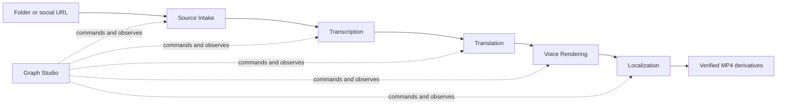

# Video Graph Studio

Video Graph Studio is a local browser control plane for reusable video MVPs. It provides a ComfyUI-style workflow canvas while keeping workflow continuation, localization media and platform receipts under separate owners.

## Start

```powershell
powershell -NoProfile -ExecutionPolicy Bypass -File apps/video-graph-studio/run.ps1
```

The launcher opens `http://127.0.0.1:8765`. It never binds to the LAN. To run without opening a browser:

```powershell
powershell -NoProfile -ExecutionPolicy Bypass -File apps/video-graph-studio/run.ps1 -NoBrowser -Port 8765
```

Choose one of the workflow templates:

- `Folder` or `URL` creates and verifies a Source Manifest.
- `Folder+ASR` or `URL+ASR` continues through a verified Transcript Manifest.
- `Folder+Translate` or `URL+Translate` continues through editable RU/EN/KK translation JSON/SRT.
- `Folder+Voice` or `URL+Voice` continues through verified per-segment Edge MP3 clips.
- `Folder+Dub` or `URL+Dub` runs all ten owner steps and produces verified subtitle-burned H.264/AAC derivatives.
- `Localize` runs the compatibility prepared-folder Edge workflow.

Exactly one workflow and one child process execute at a time. The ten-step dubbing graph calls Source Intake, Transcription, Translation, Voice Rendering and Localization only through their public launchers.



## Stop

Press `Ctrl+C` in the launcher terminal. The server requests cancellation for its active child, closes the HTTP listener and leaves completed checkpoints intact. Restarting fences an abandoned `RUNNING` step as `INTERRUPTED`; starting the run again resumes from the first missing checkpoint.

## Data root

The default data root is `%LOCALAPPDATA%\VideoGraphStudio`. Override it with `-DataRoot C:\path\to\studio-data`. `studio.db` owns graph run state and logs. Each capability keeps its artifacts below its own data-root directory; Localization owns `localized\<run-id>\localization-manifest.json` and its MP4 derivatives.

## Current evidence boundary

- Graph, run, process, HTTP and browser contracts are implemented and contract-tested.
- Source Intake, Transcription, Translation and Voice Rendering manifest workflows are domain verified; one public YouTube download and local Faster Whisper/NLLB/Edge runs have live evidence.
- Localization is platform integrated through a browser-admitted ten-step RU+KK run with real FFmpeg/FFprobe outputs. Edge TTS remains a replaceable online adapter and may return retryable service failures.
- Creator-profile discovery and authenticated uploads remain later independent slices.
- No cloud account, billing, remote access or production platform claim is made.
