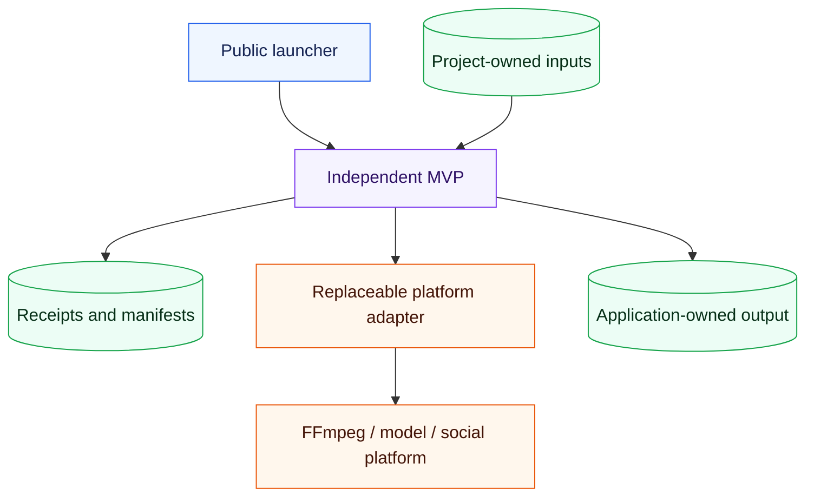

# Architecture

## The boundary is the observable result

Each application owns one mutable result. A coordinator may remember continuation state, but it does not absorb ownership from downloaders, transcript stores, voice registries, projects, or external platforms.

## Dependency direction

Applications may depend on stable schemas or process primitives in `packages/`. They may invoke external programs through adapters. They may not import private code from another application. Cross-application composition uses explicit files or public commands.

## Repository ownership

| Path | Owns | Must not contain |
|---|---|---|
| `apps/<mvp>/` | Public program boundary | Concrete video assets or another app's workflow state |
| `packages/` | Versioned schemas and tiny primitives | Application coordination |
| `projects/` | Concrete scripts, timings, and source assets | Reusable platform logic |
| `docs/mvp/` | Capability and delivery evidence | Unverified marketing claims |
| `tools/`, `.claude/skills/` | Compatibility implementations | New public entrypoints |
| Runtime output directories | Generated media and receipts | Version-controlled source |

## Application contract

Each `mvp.json` declares its name, summary, launcher, installer, test command, inputs, outputs, dependencies, and delivery level. `scripts/validate_mvp_manifests.py` verifies the contract and referenced paths.

## Failure model

An application returns success only after its declared output exists and can be inspected. External failures remain adapter errors, persisted receipts redact secrets, and partial artifacts are either cleaned up or reported explicitly.
