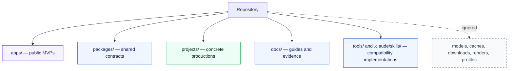

# Repository MVP Map

## Reusable programs

`apps/` contains public applications. Each application owns one result and has an independent launcher, installer, manifest, README, tests, and evidence.

`apps/creator-batch/` is the reusable cross-item continuation owner. It consumes Creator Discovery facts and public child-MVP facts; it does not own or import media-processing internals.

`apps/publication-batch/` is the reusable cross-derivative planning owner. It consumes Localization facts and invokes Publication through its public launcher; it does not own localized media, upload state or credentials.

`apps/publication-batch-execution/` is the reusable cross-plan execution owner. It consumes an exact confirmed Publication Batch fact and invokes Publication and Credential Vault only through their public launchers; it owns continuation and aggregate verification, never child upload state or secret material.

## Shared contracts

`packages/` may contain versioned schemas and small process primitives. Shared packages never coordinate an application workflow or own project state.

## Concrete productions

`projects/` contains scripts, timing manifests, footage references, and assets for individual videos. Project content may be Chinese, English, Russian, or another source language. It is not reusable application code.

## Compatibility code

`tools/`, `.claude/skills/`, `research_mvp/`, and `video_platform/` currently host proven implementations behind the new application launchers. They can be migrated internally without changing the public MVP commands.

## Evidence

`docs/mvp/<name>/` records the observable result, capability DAG, executable evidence, and honest delivery level. `DESIGNED` and `IMPLEMENTED` do not mean production verified.
