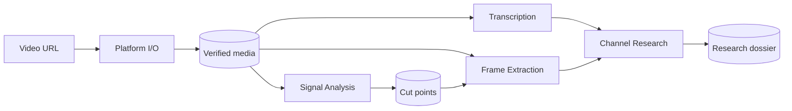
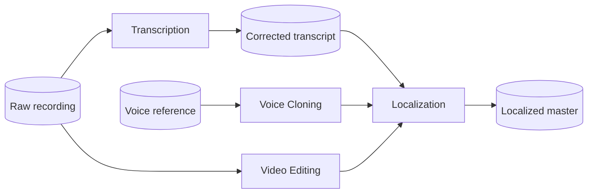
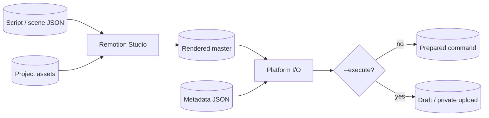
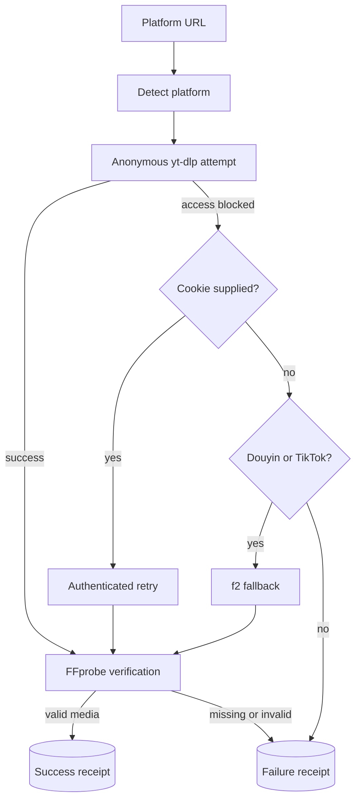

# Workflows

Applications are useful alone. These workflows show common compositions through files; none of them creates a new shared state owner.

## Research a reference video

## Edit and localize a recording

Localization is currently `DESIGNED`; the diagram documents the intended public file contracts, not a production-verification claim.

## Build visual cards and publish

## Download decision path

