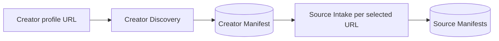
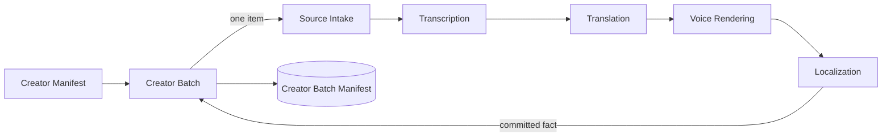
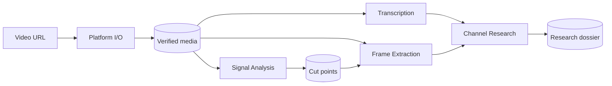
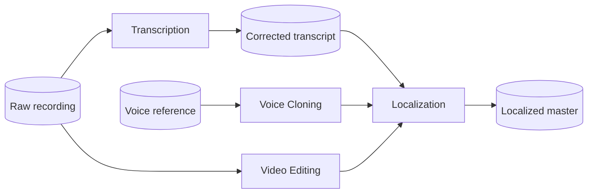
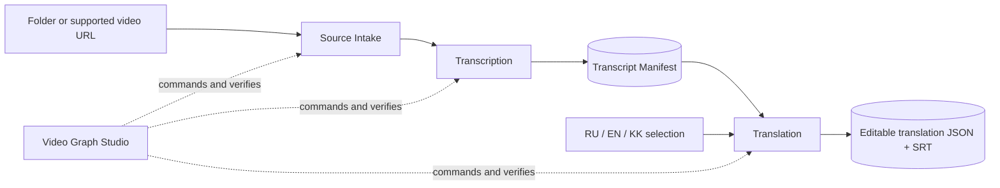
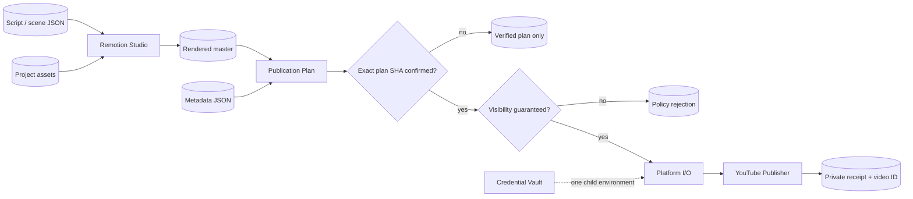
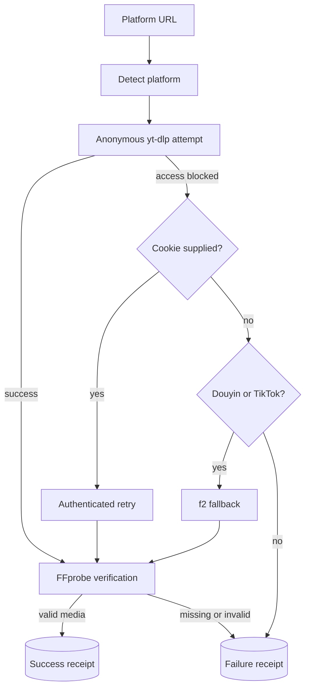

# Workflows

Applications are useful alone. These workflows show common compositions through files; none of them creates a new shared state owner.

## Discover a creator batch

Discovery commits canonical URLs only. Downloading every item is a separate, explicitly selected composition so a large profile cannot silently consume storage or network bandwidth.

Select **Creator+Dub** when that explicit composition is intended:

The loop continues after an item failure, but the aggregate manifest is withheld until every item has verified language and derivative coverage. Repeating the same operation reuses hash-verified items and retries only incomplete or stale items.

## Research a reference video

## Edit and localize a recording

Localization is `PLATFORM_INTEGRATED`: its public manifest workflow and a real local FFmpeg/FFprobe browser run are verified. Production operations and social publication remain separate, unproven capabilities.

## Transcribe and translate from the browser

Choose `Folder+Translate` or `URL+Translate` in Video Graph Studio. The graph runs six durable steps with one worker. Translation output is marked `MACHINE`; it is not yet a dubbed or subtitle-burned video.

## Build visual cards and publish

## Download decision path

