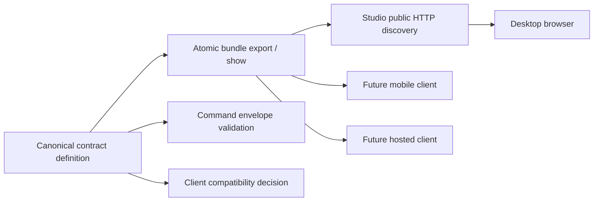

# Client Contracts capability DAG

Clients retain disposable projections. Video Graph Studio remains the authoritative run-state writer; the HTTP adapter only projects the Client Contracts owner's immutable result.
