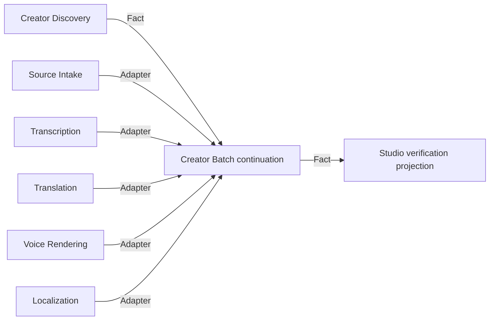

# Creator Batch capability DAG

| Node | Owner | Status | Direct dependency | Classification |
| --- | --- | --- | --- | --- |
| ordered canonical videos | Creator Discovery | `PLATFORM_INTEGRATED` | platform enumerator | hard |
| source/transcript/translation/voice/localization facts | respective five MVPs | verified | replaceable external adapters | hard owners; external adapters may be substitutes |
| strict-serial item continuation | Creator Batch | `DOMAIN_VERIFIED` | committed owner facts | lowest previously unproven node, now proven |
| browser run projection | Video Graph Studio | `DOMAIN_VERIFIED` | committed Batch fact | downstream Projection |

Removing any child owner would force the coordinator to counterfeit its artifact fact. External media/AI adapters may be deterministic substitutes without changing ownership. Automatic publication is a decision gate and is absent from this DAG.
