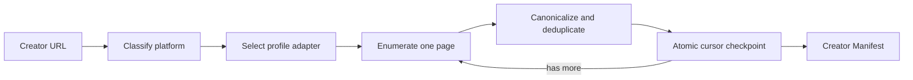

# Creator Discovery capability DAG

URL classification and the manifest owner are adapter-neutral. yt-dlp and pinned F2 are replaceable platform adapters. Graph Studio may consume the final manifest but cannot own the cursor or item set.
