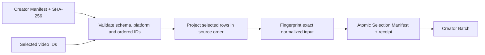

# Creator Selection capability DAG

```mermaid
flowchart LR
    M["Creator Manifest + SHA-256"] --> V["Validate schema, platform and ordered IDs"]
    I["Selected video IDs"] --> V
    V --> O["Project selected rows in source order"]
    O --> F["Fingerprint exact normalized input"]
    F --> A["Atomic Selection Manifest + receipt"]
    A --> B["Creator Batch"]
```

Creator Discovery remains the source catalog owner. Creator Batch may consume the Selection fact but cannot change its selected item set.
