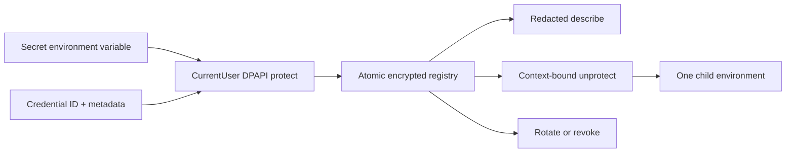

# Credential Vault capability DAG

Only Credential Vault writes the encrypted registry. A child receives plaintext for the duration of its process; the workflow and its receipts retain only the credential ID.
