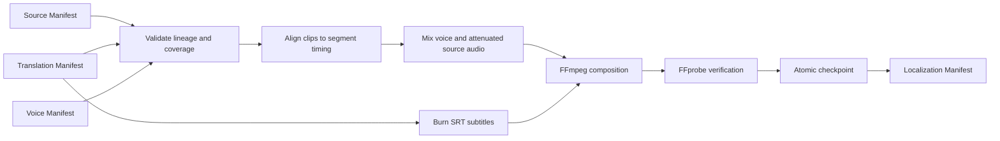

# Localization capability DAG

| Node | Owner | Invariant | Safe substitute |
| --- | --- | --- | --- |
| Validate lineage | Localization | all three upstream hashes and language/media/segment coverage agree | fixture manifests with real files |
| Align and mix | Localization policy | voice starts at segment time; only overlong voice is tempo-adjusted; source volume is declared | deterministic fake composition adapter |
| Subtitle render | Localization policy | committed SRT fingerprint is used | fixture SRT |
| Compose/probe | FFmpeg adapter | positive duration/dimensions and non-empty video/audio codecs | fake adapter for domain tests only |
| Checkpoint | Localization loop | one active composition; atomic partial-to-final rename | in-memory adapter preserving failure semantics |

Graph Studio only sends commands and stores references to committed facts. It does not absorb any node's state ownership.
