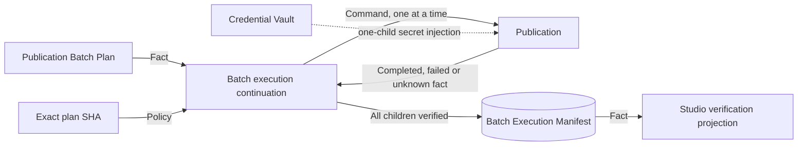

# Publication Batch Execution capability DAG

| Node | Owner | Status | Direct dependency | Classification |
| --- | --- | --- | --- | --- |
| ordered derivative publication plans | Publication Batch | `DOMAIN_VERIFIED` | committed Localization and Publication facts | hard predecessor fact |
| secret lifecycle and injection | Credential Vault | `DOMAIN_VERIFIED` | active provider-bound credential | security owner |
| one-plan guarded execution | Publication | `DOMAIN_VERIFIED` | exact child plan confirmation and Vault reference | hard child owner |
| strict-serial cross-plan continuation | Publication Batch Execution | `DOMAIN_VERIFIED` | exact batch fact and verified child facts | lowest previously unproven node, now proven |
| browser execution projection | Video Graph Studio | `DOMAIN_VERIFIED` | same-workspace completed Release fact | downstream Projection |

The coordinator does not import a child implementation or read Vault secrets. Removing Publication would make it counterfeit per-video execution state; moving continuation into Studio would make a UI own business recovery. Additional platforms are separate adapter capabilities, not branches hidden inside this owner.

