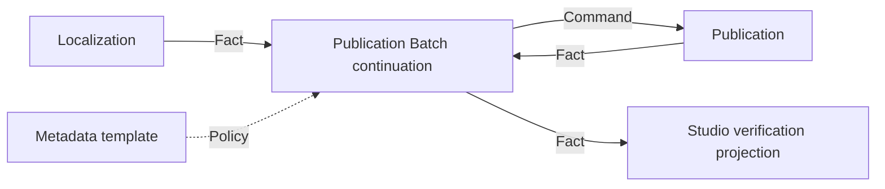

# Publication Batch capability DAG

| Node | Owner | Status | Direct dependency | Classification |
| --- | --- | --- | --- | --- |
| localized derivative set | Localization | `PLATFORM_INTEGRATED` | Source/Translation/Voice facts and FFmpeg adapter | hard predecessor fact |
| user-authored metadata strings | creator | fixed input | supported token specification | boundary-preserving policy |
| one-video multi-target intent | Publication | `DOMAIN_VERIFIED` | verified video and metadata | hard child owner |
| strict-serial derivative continuation | Publication Batch | `DOMAIN_VERIFIED` | committed Localization and Publication facts | lowest previously unproven node, now proven |
| browser run projection | Video Graph Studio | `DOMAIN_VERIFIED` | committed Publication Batch fact | downstream Projection |

Removing Publication would force the batch coordinator to counterfeit a one-video plan. Moving the loop into Studio would hide the continuation owner. Credential Vault is absent because planning stores bounded credential IDs only and never reads secret material. Automatic upload is a decision gate, not a missing internal helper.
