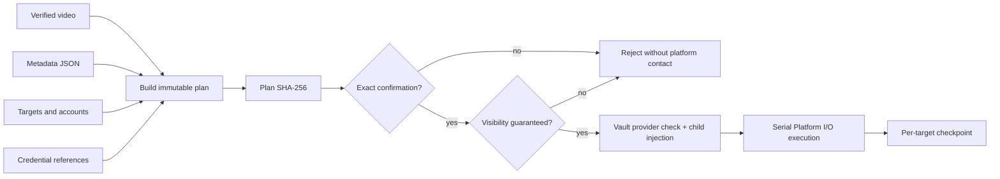

# Publication capability DAG

The planning node has no platform side effect and retains credential IDs only. The execution node never derives confirmation itself; Vault owns plaintext release and Platform I/O owns adapter execution.
