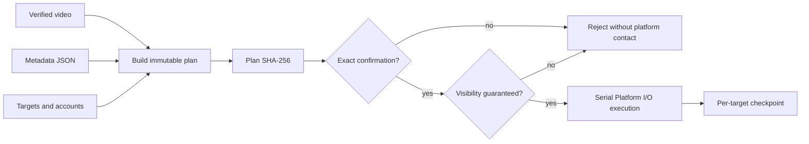

# Publication capability DAG

```mermaid
flowchart LR
    V["Verified video"] --> P["Build immutable plan"]
    M["Metadata JSON"] --> P
    T["Targets and accounts"] --> P
    P --> H["Plan SHA-256"]
    H --> C{"Exact confirmation?"}
    C -->|no| R["Reject without platform contact"]
    C -->|yes| G{"Visibility guaranteed?"}
    G -->|no| R
    G -->|yes| E["Serial Platform I/O execution"]
    E --> K["Per-target checkpoint"]
```

The planning node has no platform side effect. The execution node never derives confirmation itself.
