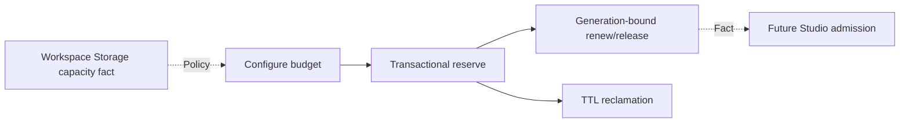

# Resource Budget capability DAG

| Node | Owner | Status | Dependency |
| --- | --- | --- | --- |
| Configure | Resource Budget | verified | SQLite durability, hard |
| Reserve | Resource Budget | verified | configured limit, hard |
| Renew/release | Resource Budget | verified | active lease generation, hard |
| TTL reclaim | Resource Budget | verified | UTC clock, hard |
| Storage capacity policy | Workspace Storage | adjacent integration verified | public CLI fact, substitute policy input |
| Studio admission | Video Graph Studio adapter | lowest unproven dependent node | Resource Budget public CLI |
