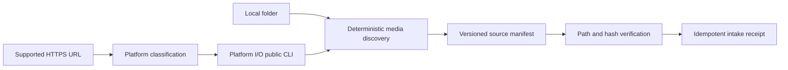

# Source Intake capability DAG

Lowest independently proven capabilities are URL classification and folder discovery. URL mode substitutes the independently owned Platform I/O CLI for network behavior; it does not copy the downloader into this application.
