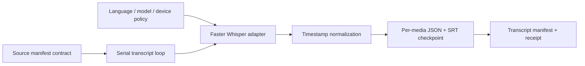

# Transcription capability DAG

```mermaid
flowchart LR
    source[Source manifest contract] --> loop[Serial transcript loop]
    policy[Language / model / device policy] --> adapter[Faster Whisper adapter]
    loop --> adapter
    adapter --> normalize[Timestamp normalization]
    normalize --> item[Per-media JSON + SRT checkpoint]
    item --> manifest[Transcript manifest + receipt]
```

The model cache is an external adapter-owned dependency. Graph Studio consumes only the public receipt and manifest.
