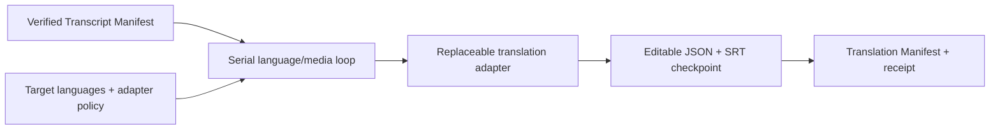

# Translation capability DAG

```mermaid
flowchart LR
    transcript["Verified Transcript Manifest"] --> loop["Serial language/media loop"]
    policy["Target languages + adapter policy"] --> loop
    loop --> adapter["Replaceable translation adapter"]
    adapter --> item["Editable JSON + SRT checkpoint"]
    item --> manifest["Translation Manifest + receipt"]
```

The local NLLB model is an adapter-owned runtime dependency. Graph Studio invokes the public launcher and consumes only the committed receipt and manifest.
