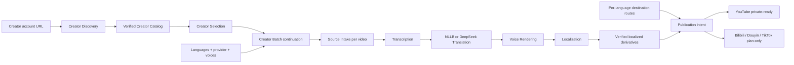

# Video Graph Studio capability DAG

Studio owns admission, continuation and browser projection only. Discovery owns the account catalog, Selection owns the exact subset, Creator Batch owns serial cross-item continuation, and media capabilities own their manifests. Destination intent does not claim publication execution. See the [full DAG](../../project/evidence/video-graph-studio/capability-dag.md).
