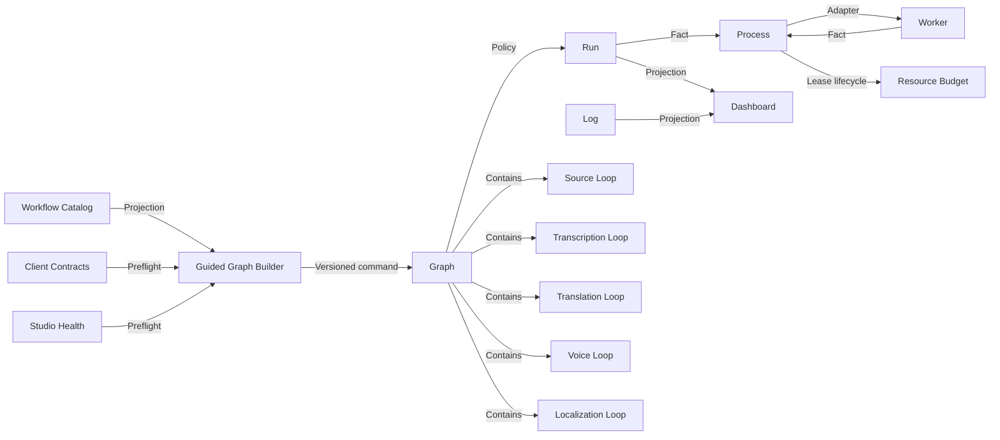

# Video Graph Studio Capability DAG

Workflow Catalog, guided Draft Graph projection, independent readiness checks, exact node/Loop rendering, Graph, Run, Queue, Process, Worker, Log, Folder Browser, Dashboard and optional Resource Budget composition are verified. The builder only selects admitted fixed Graphs; arbitrary node insertion and edge editing are deliberately absent. Real authenticated private/draft upload remains the lowest unproven platform node. See the [full DAG](../../project/evidence/video-graph-studio/capability-dag.md).
