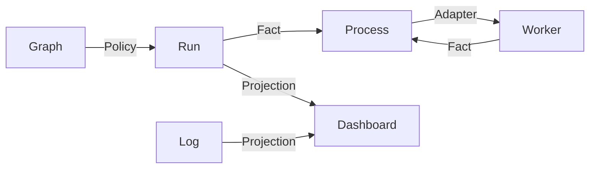

# Video Graph Studio Capability DAG

Graph, Run, Process, Worker, Log, Folder Browser and Dashboard contracts are verified. Real successful Edge localization through the graph is the lowest unproven platform node. See the [full DAG](../../project/evidence/video-graph-studio/capability-dag.md).

