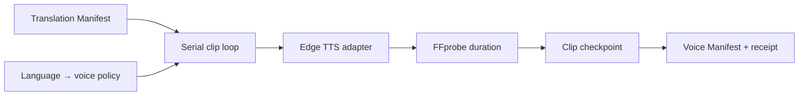

# Voice Rendering capability DAG

```mermaid
flowchart LR
    translation["Translation Manifest"] --> loop["Serial clip loop"]
    voices["Language → voice policy"] --> loop
    loop --> tts["Edge TTS adapter"]
    tts --> probe["FFprobe duration"]
    probe --> checkpoint["Clip checkpoint"]
    checkpoint --> manifest["Voice Manifest + receipt"]
```
