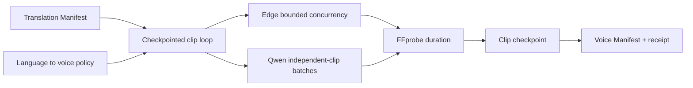

# Voice Rendering capability DAG

```mermaid
flowchart LR
    translation["Translation Manifest"] --> loop["Checkpointed clip loop"]
    voices["Language to voice policy"] --> loop
    loop --> edge["Edge bounded concurrency"]
    loop --> qwen["Qwen independent-clip batches"]
    edge --> probe["FFprobe duration"]
    qwen --> probe
    probe --> checkpoint["Clip checkpoint"]
    checkpoint --> manifest["Voice Manifest + receipt"]
```
