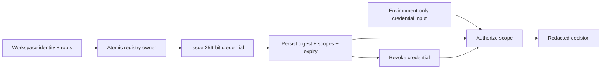

# Workspace Access capability DAG

```mermaid
flowchart LR
    W["Workspace identity + roots"] --> R["Atomic registry owner"]
    R --> I["Issue 256-bit credential"]
    I --> H["Persist digest + scopes + expiry"]
    E["Environment-only credential input"] --> A["Authorize scope"]
    H --> A
    H --> X["Revoke credential"]
    X --> A
    A --> D["Redacted decision"]
```

The credential registry is the only writer. Authorization is a query and never exposes the supplied secret or stored digest.
