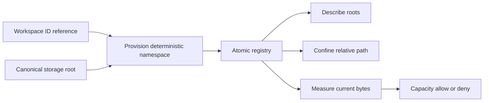

# Workspace Storage capability DAG

```mermaid
flowchart LR
    W["Workspace ID reference"] --> P["Provision deterministic namespace"]
    R["Canonical storage root"] --> P
    P --> A["Atomic registry"]
    A --> D["Describe roots"]
    A --> C["Confine relative path"]
    A --> U["Measure current bytes"]
    U --> Q["Capacity allow or deny"]
```

The registry is the only namespace writer. Path and capacity operations are queries and do not claim ownership of the files stored below a namespace.
