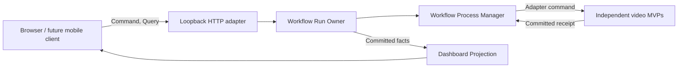

# Project Architecture

## System map

## Ownership rule

The workflow process manager owns only continuation, checkpoint order and terminal workflow outcome. It does not own downloaded media, transcript text, translations, voice identities, localized files, platform accounts or upload receipts. Those remain with their independent application or adapter owner.

## Dependency rule

- UI depends on versioned HTTP contracts, never SQLite or worker objects.
- Process composition invokes public adapters, never edits another application's private state.
- Projection consumes committed state after mutation and cannot authorize work.
- Platform-specific cookies and tokens terminate at their adapter boundary.
- A future hosted API or mobile client replaces the transport/presentation adapter without moving state ownership.

