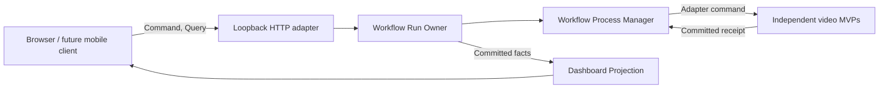

# Project Architecture

## System map

The canonical target map and ownership catalog are:

- [System component map](system-component-map.md)
- [Component catalog](component-catalog.md)
- [System design blueprints](design/blueprints/README.md)
- [Public contract catalog](design/contracts/README.md)

## Ownership rule

The workflow process manager owns only continuation, checkpoint order and terminal workflow outcome. It does not own downloaded media, transcript text, translations, voice identities, localized files, platform accounts or upload receipts. Those remain with their independent application or adapter owner.

## Dependency rule

- UI depends on versioned HTTP contracts, never SQLite or worker objects.
- Process composition invokes public adapters, never edits another application's private state.
- Projection consumes committed state after mutation and cannot authorize work.
- Platform-specific cookies and tokens terminate at their adapter boundary.
- A future hosted API or mobile client replaces the transport/presentation adapter without moving state ownership.

## Design record rule

Every new capability needs both an owner blueprint and a public contract before it may be composed into a graph. The blueprint explains lifecycle and failure semantics; the contract defines the smallest replaceable boundary. Generated artifacts and runtime evidence belong in delivery ledgers, not in architecture documents.
