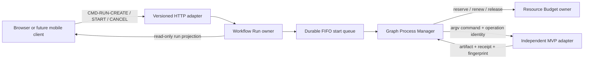
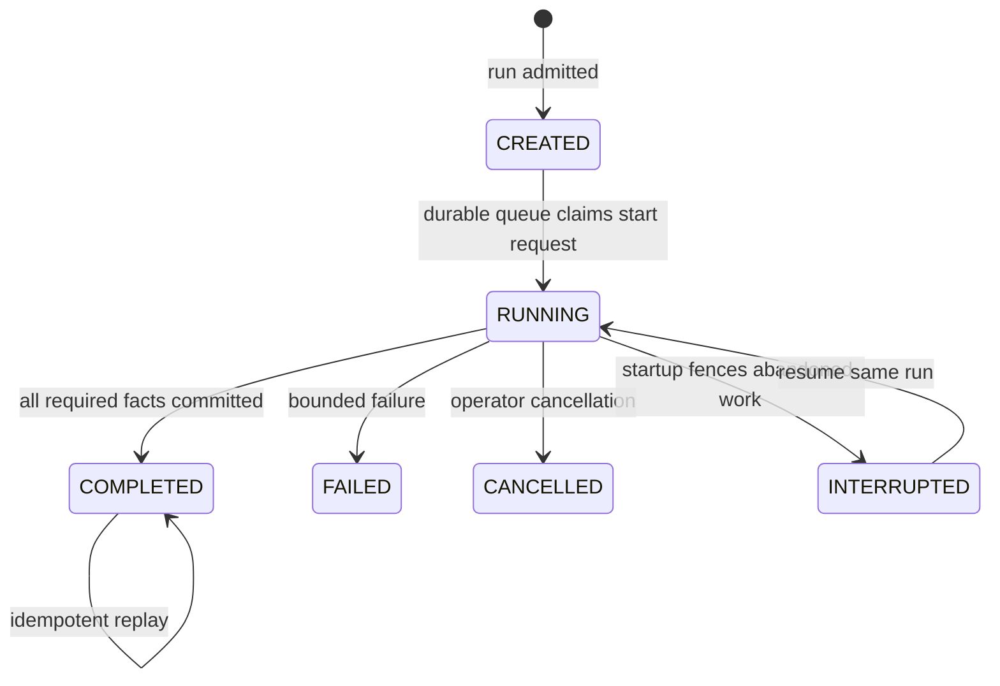

# Video Graph Studio Blueprint

## 1. Promise

Video Graph Studio lets a creator select local or social-video sources, languages, voices and target platforms in a desktop browser, then run a durable sequence of independent video programs. The same contracts are intended for a future mobile or hosted client.

## 2. State owner

The Workflow Run owns run identity, immutable graph/input fingerprints, lifecycle version and terminal workflow result. The Durable Start Queue owns requested FIFO order and queue-claim lifecycle. The Process Manager owns continuation and the active child handle. None owns media, transcript, translation, voice, render, creator-discovery or publication truth.

SQLite is the current local durable adapter. Anonymous and fixed secure modes use one database. Multi-workspace mode obtains state/artifact roots from Workspace Storage and lazily creates one SQLite RunStore per authorized workspace. Browser state is a disposable projection and cannot authorize or complete work.

## 3. Interfaces and contracts

Commands carry `contractId`, `contractVersion`, `operationId` and `correlationId`. A repeated operation with the same canonical input replays; changed input conflicts. Child operation IDs derive from run and node identity.

## 4. Lifecycle

Several runs may be queued. Every workspace has its own durable FIFO. Queued runs hold no resource lease. When optional Resource Budget composition is enabled, a claimed run reserves its operator-configured byte estimate and one execution slot before entering `RUNNING`, renews while active and releases after every terminal path. Budget denial returns the original claim to its FIFO position. All engines in one Studio process share an execution gate, so only one workflow and one child process execute at a time across all initialized workspaces. FIFO is guaranteed inside a workspace; cross-workspace scheduling order is not yet a public contract. A successor starts only after its predecessor commits and verifies its declared result.

## 5. Failure and recovery

- Startup atomically changes abandoned `RUNNING` runs and steps to `INTERRUPTED`.
- Startup returns an abandoned queue claim from `RUNNING` to `QUEUED` without changing its FIFO sequence.
- Repeating the startup fence is a no-op.
- Resume keeps completed checkpoints and starts at the first incomplete node.
- Missing output is failure even when a child exits with code zero.
- Unknown external publication outcome is quarantined for reconciliation; it is never inferred as success.
- Process loss does not make the browser the recovery authority.
- Startup releases any active reservation belonging to an already terminal run. Interrupted work reacquires the same stable reservation identity; an expired same-fingerprint reservation advances generation instead of changing run identity.

## 6. Security boundary

The local server binds only to `127.0.0.1`; paths must remain under configured allowed roots. Default local mode stays anonymous. Optional secure mode binds one Studio process and data root to one Workspace Access identity, queries its roots through the public CLI, and checks a route-specific scope before calling the Run application. `runs:read` covers run queries, `artifacts:read` covers folder browsing and `runs:write` covers mutations. Resource Budget is separately configured by the local operator; the browser cannot raise limits or mint leases.

The browser stores its credential in session storage only and strips a bootstrap fragment immediately. The HTTP adapter sends the plaintext to Workspace Access only through a subprocess environment variable; it is absent from argv, decisions, logs, manifests and receipts. Static files and health are public so a disconnected client can load and learn that admission is required. In multi-workspace mode authorization happens before runtime lookup; source roots come from Access and state/artifact roots come from Storage. A hosted version still requires remote identity, secret custody, hard reservations, audit and abuse-control owners before accepting remote traffic.

## 7. Observability

Every run exposes immutable correlation identity, versioned state, per-node status and append-only ordered logs. The queue projection exposes active run, waiting count and ordered pending entries. Receipts identify committed artifacts and fingerprints. Health reports database readiness, active-worker count and queued-run count. Logs are diagnostic telemetry; only validated receipts are completion facts.

## 8. Verification boundary

Unit and adapter tests support `DOMAIN_VERIFIED`. A named real external runtime may support `PLATFORM_INTEGRATED` for that adapter only. `PRODUCTION_VERIFIED` additionally requires representative recovery, security, load, authenticated-platform and operational evidence. The live local restart drill is recorded in [the recovery evidence](../../../evidence/video-graph-studio/recovery-drill.md), and the secure HTTP composition is recorded in [the admission drill](../../../evidence/video-graph-studio/secure-admission-drill.md).
