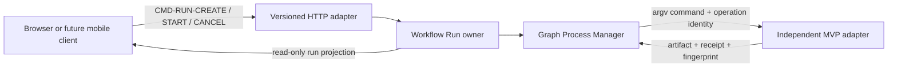
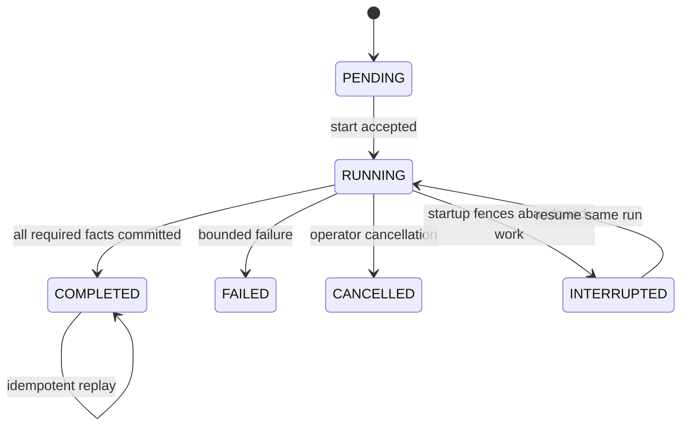

# Video Graph Studio Blueprint

## 1. Promise

Video Graph Studio lets a creator select local or social-video sources, languages, voices and target platforms in a desktop browser, then run a durable sequence of independent video programs. The same contracts are intended for a future mobile or hosted client.

## 2. State owner

The Workflow Run owns run identity, immutable graph/input fingerprints, lifecycle version and terminal workflow result. The Process Manager owns continuation and the active child handle. It does not own media, transcript, translation, voice, render, creator-discovery or publication truth.

SQLite is the current local durable adapter. Browser state is a disposable projection and cannot authorize or complete work.

## 3. Interfaces and contracts

Commands carry `contractId`, `contractVersion`, `operationId` and `correlationId`. A repeated operation with the same canonical input replays; changed input conflicts. Child operation IDs derive from run and node identity.

## 4. Lifecycle

Only one workflow and one child process execute at a time. A successor starts only after its predecessor commits and verifies its declared result.

## 5. Failure and recovery

- Startup atomically changes abandoned `RUNNING` runs and steps to `INTERRUPTED`.
- Repeating the startup fence is a no-op.
- Resume keeps completed checkpoints and starts at the first incomplete node.
- Missing output is failure even when a child exits with code zero.
- Unknown external publication outcome is quarantined for reconciliation; it is never inferred as success.
- Process loss does not make the browser the recovery authority.

## 6. Security boundary

The local server binds only to `127.0.0.1`; paths must remain under configured allowed roots. Child processes receive argv arrays. Cookie and token contents must not enter logs, manifests or receipts. A hosted version requires authenticated admission, tenant-scoped storage, secret custody, authorization and audit adapters before accepting remote traffic.

## 7. Observability

Every run exposes immutable correlation identity, versioned state, per-node status and append-only ordered logs. Receipts identify committed artifacts and fingerprints. Health currently reports database readiness and active-worker count. Logs are diagnostic telemetry; only validated receipts are completion facts.

## 8. Verification boundary

Unit and adapter tests support `DOMAIN_VERIFIED`. A named real external runtime may support `PLATFORM_INTEGRATED` for that adapter only. `PRODUCTION_VERIFIED` additionally requires representative recovery, security, load, authenticated-platform and operational evidence. The live local restart drill is recorded in [the recovery evidence](../../../evidence/video-graph-studio/recovery-drill.md).
