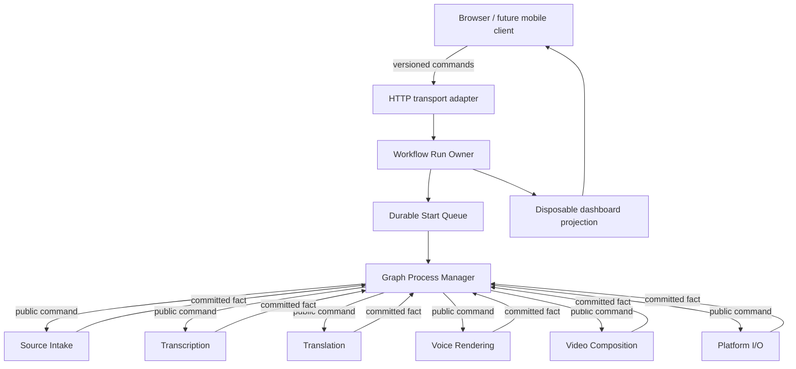
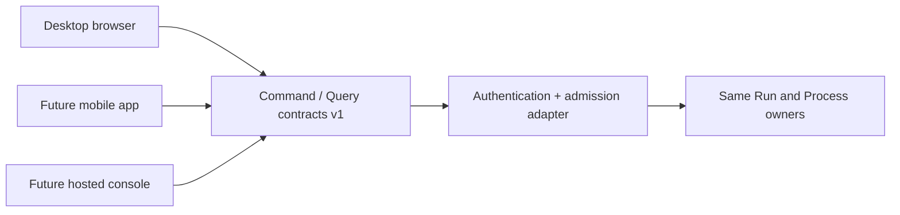

# Video Automation System Component Map

Every mutable artifact family has one authoritative writer. Coordinators own continuation, not media-domain truth.

## State owners

| Mutable state | One authoritative writer | Readers |
| --- | --- | --- |
| Graph revision/fingerprint | Graph Definition | Run admission, browser projection |
| Run lifecycle/version | Workflow Run Owner | Process, dashboard |
| Start-request order/claim | Durable Start Queue | Process, dashboard |
| Step checkpoint/continuation | Workflow Process Manager | Run projection, recovery |
| Source manifest/receipt | Source Intake | downstream adapters, verification |
| Transcript artifact/receipt | Transcription | translation, editor, dashboard |
| Translation artifact/receipt | Translation | voice, subtitle, editor |
| Voice clips/receipt | Voice Rendering | audio composition |
| Localized video/receipt | Video Composition | publication, preview |
| Upload plan/receipt | Platform I/O | dashboard, operator |
| Cookies/tokens | Credential/Profile Adapter | owning platform adapter only |

## Replaceable client boundary

Desktop currently uses loopback admission. Commercial hosting adds authentication, tenancy and remote storage as adapters/owners; it must not move workflow truth into the UI.

## Cross-boundary rules

- A program may import shared schemas, not another program's private implementation.
- A command requests work; a committed fact proves inspectable completion.
- Projections are disposable and cannot authorize media mutation.
- Platform callbacks enter through a typed adapter and cannot call another owner directly.
- Unknown partial external outcomes become failed or quarantined evidence, never inferred success.
