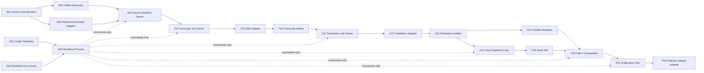

# Video Automation Capability Map

An independent capability may consume another capability's published contract. It never reads or mutates the other capability's private state.

## Build order and evidence gate

| ID | Capability | Current evidence | Next gate |
| --- | --- | --- | --- |
| G01-G03 | Graph definition, run and process ownership | `DOMAIN_VERIFIED` | crash/restart drill and production operations |
| S01-S04 | Source Intake | `DOMAIN_VERIFIED`; live YouTube evidence | profile enumeration and three remaining platforms |
| T01-T03 | Transcription | legacy `IMPLEMENTED` only | versioned manifest contract and real one-file receipt |
| L01-L03 | Translation | `DESIGNED` | adapter-neutral contract, human-editable artifact and quality checks |
| V01 | Voice segment loop | Edge implementation exists | adapter-neutral receipt and stable real completion |
| C01-C03 | Subtitle, audio and composition | partial implementation | independently verified media derivative |
| P01-P02 | Publication | guarded preparation exists | authenticated private/draft evidence per platform |

## Required substitutes

Tests may use fake ASR, translation, TTS and platform adapters only when they preserve operation identity, output shape, failure semantics and ownership. A fake adapter proves composition, not external quality or availability.
