# Video Automation Capability Map

An independent capability may consume another capability's published contract. It never reads or mutates the other capability's private state.

```mermaid
flowchart LR
    A1["A01 Workspace Registry"] --> A2["A02 Scope Authorization"]
    A2 -. "secure admission" .-> G2["G02 Workflow Run Owner"]
    N1["N01 Workspace Namespace"] --> N2["N02 Path Confinement"]
    N1 --> N3["N03 Capacity Projection"]
    N2 -. "routed roots" .-> G2
    K1["K01 Encrypted Credential Custody"] --> K2["K02 Credential Lifecycle"]
    K2 --> K3["K03 One-child Injection"]
    K3 -. "credential reference" .-> P2["P02 Platform Upload Adapter"]
    R1["R01 Client Contract Bundle"] --> R2["R02 Command Validation"]
    R1 --> R3["R03 Compatibility Decision"]
    R2 -. "transport-neutral command" .-> G2
    B1["B01 Budget Configuration"] --> B2["B02 Transactional Lease"]
    B2 --> B3["B03 Generation + TTL Lifecycle"]
    N3 -. "capacity policy" .-> B1
    B3 -. "future admission fact" .-> G2
    G1["G01 Graph Definition"] --> G3["G03 Workflow Process"]
    G2["G02 Workflow Run Owner"] --> G3
    S1["S01 Source Classification"] --> S2["S02 Folder Discovery"]
    S1 --> S3["S03 Platform Download Adapter"]
    D1["D01 Creator Profile Enumerator"] --> D2["D02 Creator Manifest Owner"]
    D2 --> S3
    S2 --> S4["S04 Source Manifest Owner"]
    S3 --> S4
    S4 --> T1["T01 Transcript Job Owner"]
    T1 --> T2["T02 ASR Adapter"]
    T2 --> T3["T03 Transcript Artifact"]
    T3 --> L1["L01 Translation Job Owner"]
    L1 --> L2["L02 Translation Adapter"]
    L2 --> L3["L03 Translation Artifact"]
    L3 --> V1["V01 Voice Segment Loop"]
    L3 --> C1["C01 Subtitle Renderer"]
    V1 --> C2["C02 Audio Mix"]
    C1 --> C3["C03 Video Composition"]
    C2 --> C3
    C3 --> P1["P01 Publication Plan"]
    P1 --> P3["P03 Publication Batch Plan"]
    P1 --> P2
    P3 --> P4["P04 Publication Batch Execution"]
    P4 --> P2
    G3 -. "commands only" .-> S4
    G3 -. "commands only" .-> T1
    G3 -. "commands only" .-> L1
    G3 -. "commands only" .-> V1
    G3 -. "commands only" .-> C3
    G3 -. "commands only" .-> P1
    G3 -. "commands only" .-> P3
    G3 -. "commands only" .-> P4
```

## Build order and evidence gate

| ID | Capability | Current evidence | Next gate |
| --- | --- | --- | --- |
| A01-A02 | Workspace Access | `DOMAIN_VERIFIED`; digest-only credentials, scope, expiry, revocation, secure Studio admission and redacted CLI evidence | hosted identity provider and security review |
| N01-N03 | Workspace Storage | `DOMAIN_VERIFIED`; deterministic disjoint roots, confined resolution, capacity projection and real two-workspace Studio routing | Resource Budget Studio composition, hosted storage, backup and production isolation evidence |
| K01-K03 | Credential Vault | `DOMAIN_VERIFIED`; env-only intake, CurrentUser DPAPI, redacted lifecycle, provider isolation, explicit rotation/revocation and real guarded-publication child injection | real platform authentication, renewal, remote KMS and production security evidence |
| R01-R03 | Client Contracts | `DOMAIN_VERIFIED`; canonical bundle, strict command validation, endpoint scopes, ownership and semantic compatibility | Studio discovery endpoint, SDK generation and real mobile evidence |
| B01-B03 | Resource Budget | `DOMAIN_VERIFIED`; SQLite byte/slot leases, two-process no-oversubscription, generation fencing, TTL/release cleanup and Storage capacity composition | Studio admission, power-loss, distributed and hosted enforcement evidence |
| G01-G03 | Graph definition, run, queue and process ownership | `DOMAIN_VERIFIED`; durable FIFO plus real process-loss recovery | power-loss, load, security and hosted operations |
| S01-S04 | Source Intake | `DOMAIN_VERIFIED`; live YouTube evidence | Creator Manifest batch composition and three remaining download platforms |
| D01-D02 | Creator Discovery | `PLATFORM_INTEGRATED`; durable page loop and real bounded Douyin profile manifest | full-profile scale and live YouTube/Bilibili/TikTok evidence |
| T01-T03 | Transcription | `DOMAIN_VERIFIED`; real Tiny/CPU and browser graph evidence | representative quality, GPU and recovery evidence |
| L01-L03 | Translation | `DOMAIN_VERIFIED`; adapter-neutral serial loop and editable artifacts | real local NLLB smoke, reviewed-text republish and quality sampling |
| V01 | Voice segment loop | `DOMAIN_VERIFIED`; adapter-neutral receipt, real Edge RU+KK completion, failed-clip resume and ten-step browser composition | representative voice/service quality evidence |
| C01-C03 | Subtitle, audio and composition | `PLATFORM_INTEGRATED`; serial recovery tests, real FFmpeg/FFprobe RU+KK derivatives and browser graph evidence | long-form quality and crash/power-loss evidence |
| P01-P02 | Publication | `DOMAIN_VERIFIED`; immutable plan, exact-hash confirmation, serial checkpoint/resume, credential-reference composition and browser planning | authenticated private/draft evidence per real platform |
| P03 | Publication Batch | `DOMAIN_VERIFIED`; ordered derivative plans, deterministic metadata, stable child IDs, failure continuation and exact aggregate coverage | live multi-derivative Release planning run |
| P04 | Publication Batch Execution | `DOMAIN_VERIFIED`; exact batch confirmation, whole-batch private-YouTube preflight, stable serial children, verified resume, uncertain-outcome fencing and Studio composition | authenticated batch upload, provider reconciliation and power-loss evidence |

## Required substitutes

Tests may use fake ASR, translation, TTS and platform adapters only when they preserve operation identity, output shape, failure semantics and ownership. A fake adapter proves composition, not external quality or availability.
