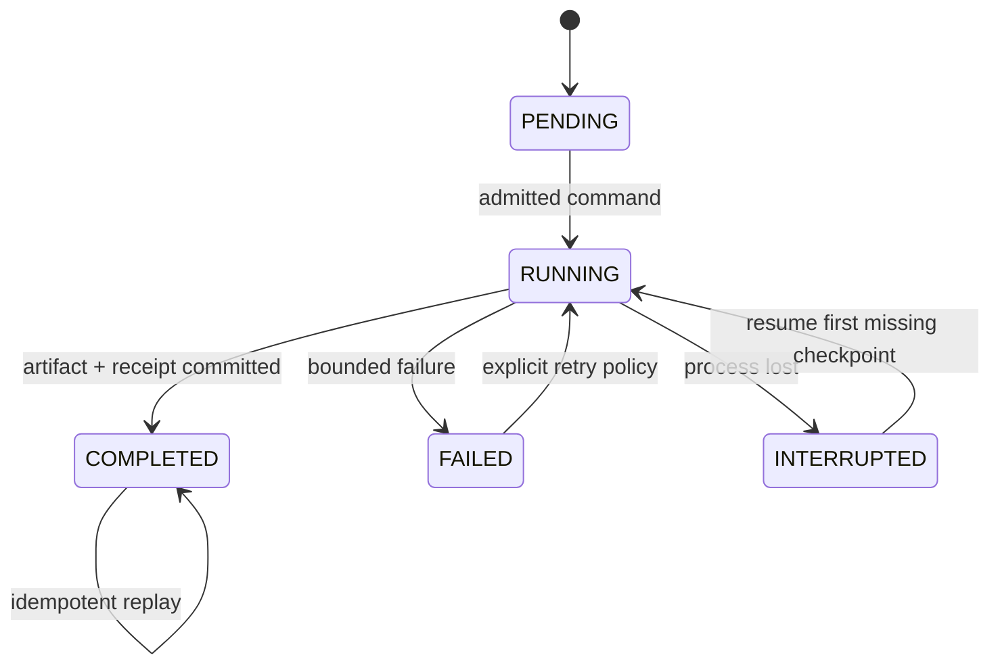

# Graph Engineering and Loop Engineering Operating Model

## Definitions

**Graph Engineering** owns admission, dependency order, continuation, cancellation and the terminal workflow outcome. **Loop Engineering** owns repeatable work over an ordered collection: media files, transcript chunks, voice segments or publication targets.

The graph never reaches inside a loop's mutable state. A loop returns a committed fact only after its declared artifact exists and validates.

## Command envelope

Every significant operation carries:

- `contractId` and `contractVersion`;
- `operationId` for replay identity;
- `correlationId` for the creator workflow;
- canonical `inputFingerprint`;
- owner/adaptor version and requested policy.

Same `operationId` plus the same `inputFingerprint` returns the original result. Changed input conflicts. A loop item ID derives from the parent operation plus stable artifact identity, never array position alone.

## Serial loop contract

1. Resolve the immutable ordered item set.
2. Read the loop receipt and verify already committed artifacts.
3. Enter the first missing item.
4. Write partial output under a non-public name.
5. Validate content, size/schema and upstream fingerprints.
6. Atomically publish the artifact and checkpoint.
7. Continue to the next item only after commit.
8. Publish a terminal loop receipt listing completed, failed and skipped identities.

Default policy isolates an item failure and proceeds only when the loop contract declares that safe. Cross-owner successor nodes never run after their required predecessor fails.

## Fact and projection rules

- `TranscriptCommitted`, `TranslationCommitted`, `VoiceSegmentCommitted`, `LocalizedVideoCommitted` and `UploadCompleted` are past-tense committed facts.
- Progress messages are telemetry, not facts.
- Dashboard projection is rebuildable from run/checkpoint/log owners.
- UI animation completion cannot mark a domain node complete.

## Resource and concurrency policy

Current execution budget is a durable FIFO of admitted workflows with one workflow, one child process and one item executing at a time. Later parallelism requires explicit CPU/GPU/network budgets, per-adapter limits and deterministic join semantics. Starting many processes is not a scaling design.

## Failure and recovery

- Missing declared artifact means failure even with exit code zero.
- Startup changes abandoned `RUNNING` checkpoints to `INTERRUPTED`.
- Resume begins at the first missing verified checkpoint.
- Unknown external publication outcome is `QUARANTINED` until reconciled.
- Credentials and cookie paths/contents are excluded from logs and durable receipts.

## Promotion evidence

Unit tests prove rules. Real child processes prove composition. Platform probes prove a named adapter/platform only. Recovery drills, security checks, load budgets and representative production runs are required for `PRODUCTION_VERIFIED`.
