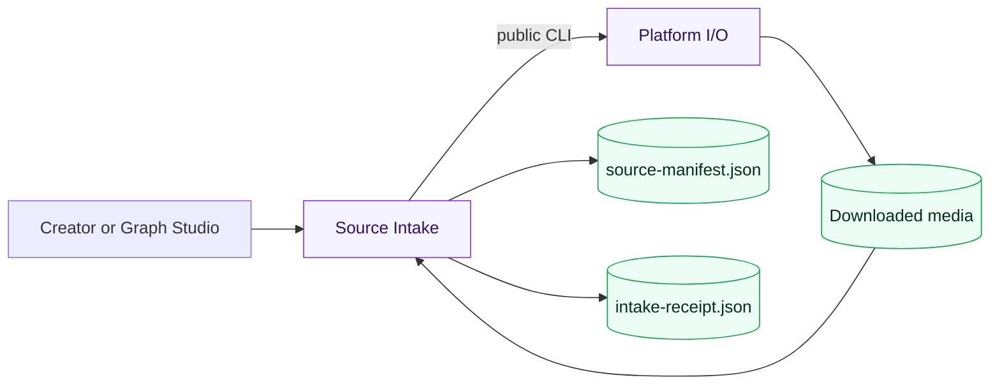

# Source Intake Delivery Ledger

| Field | Record |
| --- | --- |
| Supported completion level | `DOMAIN_VERIFIED` |
| Evidence present | URL classification; deterministic folder discovery; atomic manifest and receipt; operation replay/conflict semantics; failure isolation; cookie redaction; public PowerShell entrypoint; browser-admitted local-folder completion; anonymous YouTube download invoked through Graph Studio and FFprobe-verified (19.014 s, 320x240, AV1 + Opus) |
| Evidence missing | live Bilibili/Douyin/TikTok single-video completion in this slice; Douyin creator-profile enumeration; authenticated-cookie run; interrupted external download recovery; load, security and production operations |
| Substitutes | fake Platform I/O transport in domain tests; tiny local media fixtures; loopback Graph Studio composition for deterministic tests |
| Decisions unapproved | remote execution, cloud object storage, multi-user tenancy, commercial billing, automatic uploads and credential custody |
| Forbidden claims | no claim that YouTube evidence proves the other three platforms; no creator-profile batch-download claim; no production verification; no claim that cookies are never needed by the upstream platform |

## Live run records (2026-08-02)

| Run | Input | Result | Evidence |
| --- | --- | --- | --- |
| `96e404e9-40c2-4b66-a57b-6cf44a03c477` | local smoke folder | `COMPLETED` | one-file manifest, receipt and Graph Studio verify node |
| `ceb62102-00ae-42e2-a8b2-998cdd30386a` | supplied Douyin creator-profile share URL | `FAILED` | upstream redirect classified as unsupported profile URL; no success manifest |
| `0c2307da-b9c3-4997-a69a-6f43b37732a3` | removed yt-dlp test video | `FAILED` | platform reported unavailable; no success manifest |
| `57d9708a-35c9-4739-8c39-b11389ce09b2` | public YouTube video `jNQXAC9IVRw` | `COMPLETED` | anonymous download, receipt, manifest SHA-256, media size check and FFprobe inspection |

## Ownership boundary

