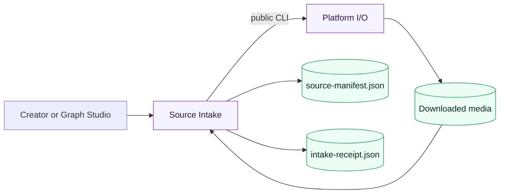

# Source Intake Delivery Ledger

| Field | Record |
| --- | --- |
| Supported completion level | `DOMAIN_VERIFIED` |
| Evidence present | URL classification; deterministic folder discovery; atomic manifest and receipt; operation replay/conflict semantics; failure isolation; cookie redaction; public PowerShell entrypoint; real Source Intake process invoked through the Graph Studio engine |
| Evidence missing | successful live YouTube/Bilibili/Douyin/TikTok download in this slice; authenticated-cookie run; interrupted external download recovery; load, security and production operations |
| Substitutes | fake Platform I/O transport in domain tests; tiny local media fixtures; loopback Graph Studio composition |
| Decisions unapproved | remote execution, cloud object storage, multi-user tenancy, commercial billing, automatic uploads and credential custody |
| Forbidden claims | no platform integration until a real platform download and media probe succeed; no production verification; no claim that cookies are never needed by the upstream platform |

## Ownership boundary

