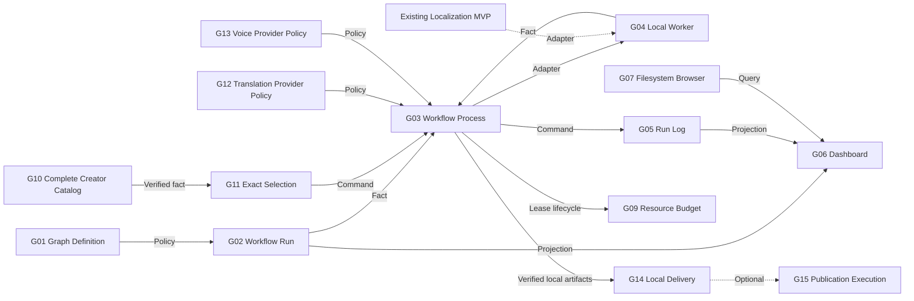

# Video Graph Studio Capability DAG

| Node | Result and owner | Status | Direct dependencies | Classification |
| --- | --- | --- | --- | --- |
| G01 | immutable validated graph | verified | none | hard |
| G02 | idempotent versioned run | verified | G01 Policy | hard |
| G03 | resumable ordered continuation | verified | G02 Fact | hard |
| G04 | one owned child process | verified | G03 Command | hard |
| G05 | append-only ordered log | verified | G02 identity | hard |
| G06 | read-only browser projection | verified | G02/G05 Projection | real loopback browser smoke |
| G07 | allowed-root folder evidence | verified | fixed configured roots | substitute: local filesystem only |
| G08 | real successful Edge media result | verified | external Edge service and localization MVP | named platform integration |
| G09 | reserve/renew/release local capacity | verified | Resource Budget public CLI | optional hard admission gate |
| G10 | complete, non-truncated creator catalog | verified | Creator Discovery manifest | hard campaign gate |
| G11 | exact creator subset | verified | G10 Fact | hard campaign gate |
| G12 | explicit NLLB/DeepSeek translation policy | verified | provider readiness projection | substitutable provider |
| G13 | explicit Edge/Qwen3/original voice policy | verified | locale compatibility and provider readiness | substitutable provider |
| G14 | verified local MP4 delivery | verified contract/domain boundary | G03 and localization facts | hard completion boundary |
| G15 | authenticated private/draft upload receipt | unproven | Credential Vault, Publication and Platform I/O | optional platform gate |

The lowest unproven platform node is G15. It is optional and therefore does not block local campaign completion, but it blocks any claim that Studio completed a real authenticated upload.
