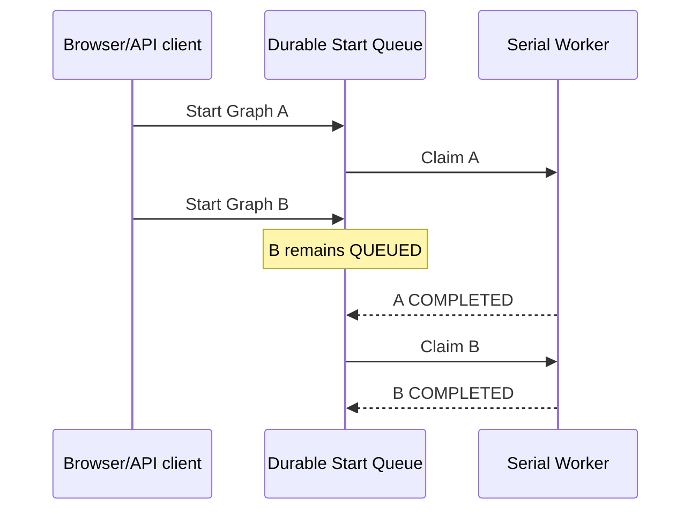

# Durable FIFO Queue Drill

## Claim under test

Several Graph start requests can be admitted through real loopback HTTP while one worker drains them in durable FIFO order with maximum workflow/adapter concurrency of one.

## Environment and inputs

| Field | Value |
| --- | --- |
| Date | 2026-08-02 |
| Transport | real `ThreadingHTTPServer` bound to an ephemeral `127.0.0.1` port |
| Durable adapter | SQLite under `%TEMP%\VideoGraphStudioQueueLive` |
| Graph | three-node `prepared-localization` template |
| First run | `cfa0115e-2da3-44a3-9425-a4ea26efa256` |
| Second run | `c859bf34-65ee-46cb-833e-650fdb8a2542` |
| Adapter | deterministic blocking probe; no external platform claim |

## Drill

1. Create and start the first Graph through the versioned HTTP API.
2. Block its first adapter invocation after it becomes active.
3. Create and start the second Graph through the same HTTP API.
4. Confirm both start commands return HTTP `202` and `/api/v1/queue` reports one waiting run.
5. Release the first adapter and observe all three first-run nodes finish.
6. Observe all three second-run nodes start only after the first run finishes.
7. Confirm both runs are `COMPLETED`, the queue is empty and maximum active adapters remained one.
8. Open the real Studio page in the in-app browser, confirm the Queue & Recent projection shows an admitted `CREATED` run, and measure zero overlap between the main graph and Activity panel.

## Supported conclusion

The local control plane is domain verified for durable multi-run admission, FIFO drain, idempotent enqueue, queued-run cancellation isolation, browser-visible run history and maximum concurrency one. Deterministic tests also requeue an abandoned queue claim after restart. This drill does not prove external adapter capacity, hosted scheduling, priorities, tenant fairness or production load.
