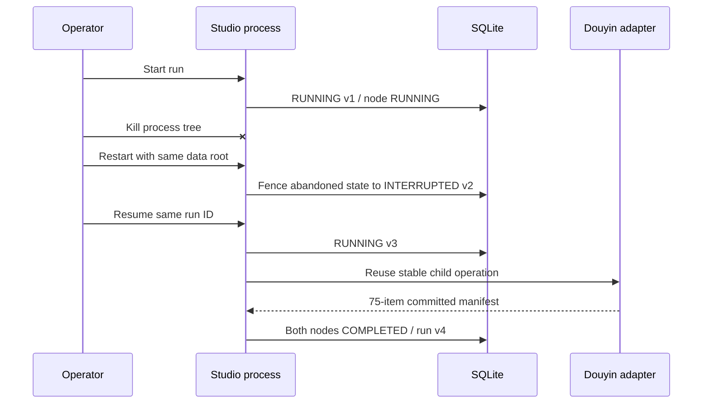

# Live Process-Loss Recovery Drill

## Claim under test

A durable Video Graph Studio run survives loss of its server process, is fenced on restart and resumes the same run from the first incomplete checkpoint without inventing completion.

## Environment

| Field | Value |
| --- | --- |
| Date | 2026-08-02 |
| Listener | loopback `127.0.0.1:8771` |
| Durable adapter | SQLite in `%TEMP%\VideoGraphStudioRecoveryLive2` |
| Graph | `creator-profile` revision 1 |
| Run ID | `1f1e77ff-b557-4d20-89d0-e3dedb8af34d` |
| Correlation ID | `recovery-live-corr-2` |
| External adapter | `f2-douyin-profile@0.0.1.7` |
| Requested bound | 100 items, one active page |

The run used the supplied local authentication-file reference. Credential content was not copied into the run projection or receipt.

## Ordered drill

1. Admit and start the two-node creator-profile graph.
2. Confirm the durable run and first node are `RUNNING`; second node remains `PENDING`.
3. Terminate the process tree that owns the HTTP listener and confirm the port is closed.
4. Inspect SQLite while the service is absent. The durable state remains `RUNNING v1`, proving no graceful completion handler ran.
5. Restart the server against the exact same data root.
6. Confirm startup changes the run to `INTERRUPTED v2` and the active step to `INTERRUPTED`; the pending step is unchanged.
7. Submit `CMD-RUN-START` for the same run ID.
8. Observe `RUNNING v3`, then wait for the external adapter and verification node.
9. Confirm terminal `COMPLETED v4` and close the server cleanly.

## Result

- Terminal run state: `COMPLETED`
- Creator-discovery node: `COMPLETED`, version 4
- Verification node: `COMPLETED`, version 2
- Verified canonical URLs: 75
- Manifest SHA-256: `7056625a4b0229738c0687764edca0afd26f72954fda1dec3df260fe5bb3dac7`
- Durable logs: seven; the first node has two start entries, preserving the pre-crash and resumed attempts
- `nextCursor`: null; `complete`: true; `truncated`: false
- Listener after cleanup: closed

## Supported and unsupported conclusions

This is real local process-loss and external-adapter recovery evidence. It supports the Studio's `DOMAIN_VERIFIED` lifecycle claim and the named Douyin adapter's existing platform-integration claim. It does not prove power-loss filesystem durability, remote database failover, hosted multi-tenant recovery, authenticated publication recovery, load limits or `PRODUCTION_VERIFIED` operations.
