# Douyin Russian Localization Batch — Design

Date: 2026-07-30

## Goal

Turn the 74 verified public videos from the Douyin account `百年工业` into Russian-localized derivatives. Each derivative must contain Russian narration, Russian burned-in subtitles that fully replace the existing lower narration captions, retained non-dialogue audio where practical, and an auditable per-video job record. Source media is immutable.

## Product assumptions

- The existing Russian reference at `projects/game-design-course/voice/reference-ru.wav` is authorized for this production and is the default Qwen3-TTS clone voice.
- The target is Russian-language technical narration, not literal word-for-word translation. Brands, numbers, units, dates, and technical facts must be preserved.
- Existing lower Chinese captions, including the one sampled bilingual Chinese/English layout, must become unreadable before Russian captions are rendered.
- Chinese labels inside diagrams, product footage, or upper/right disclaimers are not narration captions and are outside this batch's visual replacement scope.
- No upload or publication is part of this slice.

## Considered approaches

### A. Fast preset narration

Use Edge `ru-RU-DmitryNeural`, replace the complete source audio, and burn Russian subtitles. This is fast and Russian-native, but it loses music/effects and does not use the authorized reference voice.

### B. Cloned narration without stem preservation

Use Qwen3-TTS with the existing Russian reference, replace the complete source audio, and burn Russian subtitles. This preserves voice identity but loses the original sound bed.

### C. Full localization pipeline — selected

Use GPU Whisper timestamps, local Qwen translation, Qwen3-TTS cloning, dialogue/background separation, timeline-aware narration alignment, blurred caption replacement, Russian ASS rendering, and NVENC output. It costs more processing time but produces the intended reusable result.

## Architecture

The workflow composes independently owned file artifacts. No stage mutates another stage's artifact.

```mermaid
flowchart LR
    source["Verified source MP4"] --> inventory["Localization job owner"]
    inventory --> asr["Transcription adapter"]
    asr --> transcript["Chinese transcript JSON"]
    transcript --> translate["Translation adapter"]
    translate --> russian["Russian segment JSON + SRT"]
    russian --> voice["Qwen3-TTS voice adapter"]
    voice --> clips["Russian WAV clips"]
    source --> separate["Audio separation adapter"]
    separate --> bed["No-vocals sound bed"]
    clips --> align["Timeline aligner"]
    bed --> mix["Dialogue/music mixer"]
    align --> mix
    russian --> render["Caption replacement renderer"]
    source --> render
    mix --> render
    render --> final["Verified Russian MP4"]
```



### State owners

| Mutable state | Sole owner | Public artifact |
|---|---|---|
| Batch discovery and per-video stage status | Localization job ledger | `batch-manifest.json`, `jobs/{id}/job.json` |
| Speech recognition result | Transcription adapter | `transcript.zh.json`, `transcript.zh.srt` |
| Russian wording | Translation adapter | `translation.ru.json`, `subtitles.ru.srt` |
| Synthesized speech | Voice adapter | `voice/clips/*.wav`, `voice/manifest.json` |
| Non-dialogue source bed | Separation adapter | `audio/no_vocals.wav`, `audio/separation.json` |
| Aligned narration and final mix | Audio compositor | `audio/narration.wav`, `audio/mix.wav`, `audio/mix.json` |
| Caption replacement and encode | Video renderer | `final/{id}.ru.mp4`, `render.json` |

## Processing policies

### Transcription

- Use `faster-whisper` large-v3 on CUDA with Chinese language locked, VAD, and word timestamps.
- Load the model once per batch.
- Preserve word timings; downstream stages never ask an LLM to recreate timestamps.
- Empty or implausibly short transcripts fail the job before translation.

### Translation

- Use local Ollama with official `qwen3.5:9b`, `think=false`, temperature `0`, context `4096`, and structured JSON output.
- Send immutable segment IDs plus Chinese text and target duration; merge Russian text back by ID.
- Validate exact ID coverage, non-empty Cyrillic output, preserved numerals/units, and absence of unintended Chinese residue.
- If synthesized speech exceeds its slot by more than 35%, request a concise Russian rewrite for that segment only. Facts may not be dropped.

### Voice synthesis

- Use the existing CUDA environment at `tools/qwen3tts-env` and cached `Qwen3-TTS-12Hz-0.6B-Base` model.
- Create one reusable clone prompt from the authorized 9.05-second Russian reference and its exact transcript.
- Keep one model resident and synthesize resumable segment batches; never run competing GPU workers on the 8 GB GPU.
- Normalize individual clips before alignment. Stretching is limited to intelligible ranges; overlong clips trigger concise retranslation before stronger time compression.

### Original audio preservation

- Separate dialogue from the already-mixed stereo source through `audio-separator==0.44.5` with the two-stem `MDX23C-8KFFT-InstVoc_HQ.ckpt` model and retain the replaceable adapter boundary. Keep both `Vocals` and `Instrumental` stems for QA; use `Instrumental` as the Russian mix bed. Record the required MIT/UVR attribution in the application documentation.
- Keep the no-vocals bed. Do not mix the original final track under Russian narration because that would reintroduce Chinese speech.
- Duck the bed under narration and normalize the final mix to approximately `-16 LUFS`, true peak at or below `-1.5 dBTP`.
- If separation fails for a video, mark the stage retryable. A narration-only substitute may be produced for diagnosis but is not accepted as the final batch result.

### Subtitle replacement

- The batch contains 73 sources at 1280×720 and one at 1270×720; sampled narration captions occupy approximately `y=600–700`, including a bilingual two-line case.
- Replace the full-width `y=580–720` band on 1280×720 sources and scale that band proportionally for the 1270×720 source: blur the underlying region, add a restrained dark overlay, then render Russian ASS captions.
- Use a Cyrillic-capable semibold sans-serif, white text, dark outline/shadow, centered, at most two lines, within the 140-pixel band.
- Long Russian text is wrapped and, if needed, concisely rewritten; font shrinking below the readability floor is not allowed.

### Encoding

- Preserve each source's geometry and frame rate.
- Encode H.264 with NVENC using a quality-oriented constant-quality configuration; encode audio as AAC stereo.
- Source files are never overwritten.

## Job layout

```text
downloads/douyin/creator-1338558235019738-full/russian/
  batch-manifest.json
  jobs/{video-id}/
    job.json
    transcript.zh.json
    transcript.zh.srt
    translation.ru.json
    subtitles.ru.srt
    voice/
      manifest.json
      clips/*.wav
    audio/
      vocals.wav
      no_vocals.wav
      narration.wav
      mix.wav
      separation.json
      mix.json
    render.json
  final/
    [{video-id}] {source-title}.ru.mp4
```

Every stage records an input fingerprint, adapter/version, output paths, output fingerprints, started/completed timestamps, and an error classification. A completed stage is skipped only when fingerprints and declared outputs still match.

## Recovery and error handling

- Jobs are independent; one failure never stops completed work from remaining valid.
- Network-dependent model/runtime downloads and Ollama installation are setup stages, not hidden per-job side effects.
- Translation retries only failed chunks or segments.
- Voice generation retries only missing/invalid clips.
- Renderer output is written to a temporary file and atomically moved after validation.
- Interrupted jobs resume from the lowest unverified stage.
- Source, quarantined non-target media, and earlier download evidence remain untouched.

## Verification

### Representative pilot gate

The 37-second shortest video is the first end-to-end fixture. It must prove:

- transcript covers the spoken interval;
- Russian segment IDs and timestamps are complete;
- Russian narration is intelligible and aligned without extreme speed-up;
- Chinese/English lower captions are unreadable in sampled frames;
- Russian captions stay inside the replacement band;
- final media has one video stream, one audio stream, source-matching duration, 1280×720 geometry, and no decode errors.

### Batch gate

- Exactly 74 final MP4s map one-to-one to the corrected 74-ID source manifest.
- No zero-byte or partial outputs exist.
- Every output passes `ffprobe`; representative beginning/middle/end frames pass caption-region inspection.
- Audio loudness and true peak stay within policy.
- Batch ledger reports no unclassified or silently skipped job.

## Vertical-slice brief

- **Observable result:** one source video becomes a verified Russian-dubbed MP4 with replaced lower captions; after the pilot, the same contract processes all 74 jobs independently.
- **Use cases:** discover batch, transcribe, translate, synthesize, separate, align/mix, render, resume, query status, verify.
- **State owners:** listed in the architecture table; each artifact has exactly one writer.
- **Protected invariants:** immutable sources, one-to-one video IDs, timestamp ownership, idempotent stage completion, content fingerprints, atomic finalization, bounded audio time compression, recoverable failures.
- **Decision gates:** none; the user has authorized the selected defaults without further approval prompts.
- **Non-goals:** uploads, removal of arbitrary in-frame Chinese graphics, historical/private Douyin content, legal clearance, or a claim of human-reviewed literary translation for every line.

## Capability DAG

| Node | Result | Owner | Status at design time | Direct dependencies | Dependency class |
|---|---|---|---|---|---|
| Inventory | 74 immutable source jobs | Localization ledger | verified | corrected download manifest | hard fact |
| Timed ASR | Chinese segments and word times | Transcription adapter | unproven on this batch | source media, CUDA Whisper | hard adapter |
| Translation | Russian text keyed by segment ID | Translation adapter | unproven | timed ASR, local Qwen | hard adapter |
| Voice | cloned Russian clips | Voice adapter | English precedent only | Russian text, authorized reference, Qwen3-TTS | hard adapter |
| Separation | no-vocals sound bed | Separation adapter | absent | source audio, stem model | hard adapter |
| Alignment/mix | duration-matched Russian mix | Audio compositor | partial precedent | voice clips, timings, sound bed | hard strategy |
| Caption replacement | old captions unreadable, Russian visible | Video renderer | unproven | Russian SRT, source video | hard policy |
| Pilot final | one verified localized derivative | Localization ledger | unproven | all prior nodes | hard projection |
| Batch final | 74 verified derivatives | Localization ledger | blocked by pilot | pilot final, batch recovery | hard projection |

The lowest unproven node is timed ASR on the representative source video.

## Capability evidence at design time

- **Public contract and owner:** defined above.
- **RED assertion:** no current command can produce the declared pilot derivative; existing Localization is `DESIGNED` only.
- **Focused contract tests:** none yet; they belong to the implementation plan.
- **Adjacent integration:** Qwen3-TTS has prior CUDA evidence for 38 English clips; FFmpeg/libass/NVENC and the 74-source inventory are verified independently.
- **Failure matrix:** duplicate source IDs and wrong-account media were already handled by the download stage; stale artifacts, translation mismatch, missing voice clips, separation failure, interrupted render, and cleanup remain implementation cases.
- **Executable evidence:** repository audit, 74-media metadata audit, representative frame inspection, audio-stream/loudness inspection, CUDA/Qwen environment probe.
- **Non-goals:** listed above.

## Delivery ledger at design time

- **Level:** `DESIGNED`
- **Evidence present:** source inventory, fixed subtitle-region evidence, uniform audio format evidence, working CUDA Qwen environment, prior Qwen clone outputs, available NVENC/libass.
- **Evidence missing:** current-video ASR, local translation, Russian clone pilot, source separation, caption replacement render, resumability, and full-batch validation.
- **Substitutes:** Edge Russian TTS exists as a diagnostic fallback only; narration-only audio is not an accepted final substitute.
- **Unapproved decisions:** none for this run.
- **Forbidden claims:** the 74-video Russian batch is not implemented or complete until the pilot and batch verification gates pass.
