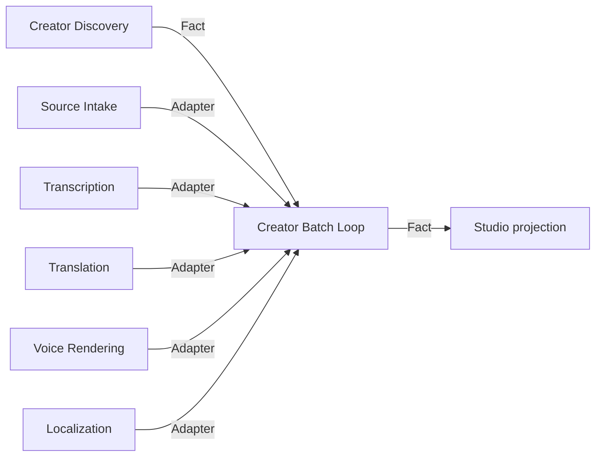

# Creator Batch Loop design

## Observable result

A creator profile URL submitted in Video Graph Studio becomes one verified Creator Manifest and then one durable, strictly serial localization batch. Every discovered video is downloaded, transcribed, translated into the selected languages, rendered with the selected Edge voices, subtitle-burned, and recorded in a final batch manifest. A failed item does not erase completed items; a rerun with the same operation identity skips verified work and retries only incomplete items.

## Scope and approaches

Three approaches were considered:

1. **Independent Creator Batch Loop MVP (selected).** Consume the existing Creator Manifest and invoke the five existing public MVP launchers per item. This preserves owners, works without Studio, and gives the browser one composable Loop node.
2. Add dynamic/nested nodes directly to Studio's generic engine. This is more general, but it expands the control-plane contract before one concrete loop proves the required semantics.
3. Implement another social publisher first. This advances target coverage, but account approval and platform credentials prevent an end-to-end result on this computer and do not solve the requested 74-video serial workflow.

## State owners and invariants

| Mutable state | Unique owner | Protected invariant | Public mutation | Public fact |
| --- | --- | --- | --- | --- |
| creator enumeration and canonical URL order | Creator Discovery | stable unique item identity and order | `profile` command | Creator Manifest |
| per-item download artifacts | Source Intake | verified local media matches the source URL | `url` command | Source Manifest + receipt |
| transcript artifacts | Transcription | complete source-media coverage | manifest command | Transcript Manifest + receipt |
| language text/subtitles | Translation | exact language/media coverage and source timing | manifest command | Translation Manifest + receipt |
| speech clips | Voice Rendering | selected voice and segment coverage | manifest command | Voice Manifest + receipt |
| localized MP4 derivatives | Localization | exact media/language coverage and verified codecs | manifest command | Localization Manifest + receipt |
| item order, continuation, retry and aggregate completion | Creator Batch | one active item; immutable input fingerprint; completed-item hash fence | `localize` command | Batch receipt + Batch Manifest |
| run queue and browser projection | Video Graph Studio | durable FIFO and no ownership of child artifacts | Run command | run/step/log projection |

Creator Batch owns no media, transcript, translation, voice, or derivative content. It stores only committed child paths, fingerprints, counts, and continuation state.

## Capability DAG

The lowest unproven node is the Creator Batch continuation owner. All six content-producing dependencies already have public contracts and verified implementations.

## Batch contract

The independent launcher accepts a Creator Manifest, ordered language/voice mappings, optional Netscape cookies, ASR/translation settings, source-audio volume, output directory, and operation ID. It validates creator item order and fingerprints all non-secret inputs. Cookie contents are represented only by a SHA-256 value inside the aggregate input fingerprint; the path and contents are absent from receipts and manifests.

Each item uses a stable child operation prefix derived from the batch operation ID, ordinal, and creator item ID. Its stable output directory lets every child MVP apply its own idempotency and resume rules. Exactly one item processor may be active. The loop continues after an item failure so one unavailable video cannot prevent later videos from being attempted. The overall receipt is `FAILED` while any item is incomplete; rerunning retries incomplete entries and retains hash-verified completed entries. Only complete coverage produces `creator-batch-manifest.json` and `COMPLETED`.

The batch manifest records creator-manifest identity, ordered expected item IDs, language and voice policy, maximum observed item concurrency, and one localization-manifest path/hash per item. Studio independently opens every referenced Localization Manifest and verifies derivative file hashes, sizes, codecs, and exact language coverage.

## Studio composition

The new `creator-batch-dub` Graph contains four nodes: discover creator, verify Creator Manifest, execute Creator Batch, and verify the batch. The browser exposes **Creator+Dub** with the existing creator URL/max-items/cookie controls plus language, voice, ASR, translation, and source-volume controls. Studio persists only local path references and non-secret policies.

## Failure and recovery

- Duplicate operation + identical fingerprint: resume or return `DUPLICATE_COMPLETED` after all hashes verify.
- Duplicate operation + changed creator manifest or policy: `REJECTED_CONFLICT` before child execution.
- Child failure or missing receipt/manifest: record a bounded safe error, continue later items, return `FAILED`, and omit the aggregate manifest.
- Stale completed item fingerprint: reprocess that item through stable child operation IDs; child owners decide duplicate/conflict behavior.
- Process loss: the last atomic receipt remains authoritative; a `RUNNING` item is treated as incomplete on the next invocation.
- Cancellation: Studio terminates the batch command; committed per-item checkpoints remain reusable. Production-grade descendant process fencing remains separate operational evidence.

## Verification and delivery level

Focused tests must prove manifest validation, strict ordering, one-active-item behavior, continue-after-failure, partial-resume, duplicate completion, conflict rejection, stale-output repair, cookie redaction, CLI contracts, and Studio Graph admission/verification. An adjacent integration uses real child MVP command boundaries with deterministic fake content adapters. No live profile download or online ASR/TTS run is required for this slice, so the maximum supported level is `DOMAIN_VERIFIED` until a real multi-item browser batch completes.

## Non-goals and decision gates

- No automatic publication follows localization.
- No parallel item execution; strict serial processing is the product default.
- No new translation-quality claim.
- No hosted scheduler, distributed queue, mobile filesystem picker, billing, or production power-loss claim.
- Retention/deletion policy, automatic public posting, and commercial tenancy remain decision gates.
