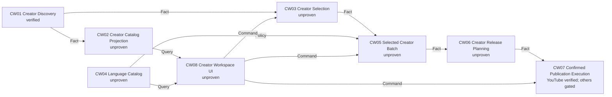

# Creator Workflow Studio Design

**Date:** 2026-08-02  
**Status:** Approved by the user's explicit product requirements  
**Design chain:** Product result → Capability MVPs → Architecture → Decisions → Engineering → Tests

## Product result

A creator pastes one YouTube, Bilibili, Douyin or TikTok account URL, sees that account's videos before downloading them, selects any subset, adds one or more supported language/voice variants, assigns one or more destination platforms and accounts to each variant, and supervises download → subtitle acquisition → translation → voice → composition → publication from one browser workspace.

The Studio is a project workspace, not an arbitrary infinite node editor. It may visualize the fixed admitted workflow, but it never requires panning, connecting ports or inserting decorative nodes to finish the job.

## Vertical-slice brief

| Field | Contract |
|---|---|
| Observable result | A discovered creator catalog can be filtered and selected, and the exact selected videos can start a resumable multilingual localization campaign from the same page. |
| Commands | Discover creator; save video selection; start campaign; confirm a publication plan; cancel campaign. |
| Queries | Creator catalog; language/voice catalog; platform/account readiness; campaign progress; artifact and subtitle status. |
| State owners | Creator Discovery owns the account manifest; Creator Selection owns selected video IDs; Language Catalog owns supported locale/voice facts; Creator Batch owns per-video localization continuation; Publication Batch owns plans; Publication Execution owns upload receipts; Studio owns only campaign continuation and projections. |
| Protected invariants | No download before selection; exact manifest fingerprints; stable parent/child operation IDs; one active child process; one derivative for every selected video/language pair; no upload without a committed plan, exact confirmation and credential; completed children are never repeated. |
| Decision gates | Public visibility remains disabled; real Bilibili/Douyin/TikTok execution requires credential-backed adapters with receipt evidence; source-caption acquisition needs a platform metadata/subtitle adapter. |
| Non-goals | Free-form executable node editing, uncontrolled parallel children, public uploads, remote multi-tenant hosting and mobile application packaging. |

## Experience

### 1. Creator

The first screen contains a creator URL, optional cookies file and **Load videos**. Loading runs only Creator Discovery. It does not download media.

### 2. Videos

The resulting catalog uses compact rows/cards with title, platform identity, publication time and subtitle state. It supports Select all, Clear, search and individual selection. Subtitle state is one of:

- `SOURCE_AVAILABLE`: a source subtitle track is known;
- `SOURCE_MISSING`: platform metadata proves no source subtitle;
- `UNKNOWN_ASR`: current discovery cannot prove either case, so the campaign will transcribe audio.

Unknown is never displayed as “has subtitles.”

### 3. Languages

Languages come from a backend Language Catalog rather than three hard-coded checkboxes. The searchable catalog exposes locale, display name, NLLB target code, default Edge voice and capability status. Every selected language row has:

- voice selector or explicit voice ID;
- subtitle output enabled by default;
- dubbing enabled by default;
- per-language destination selection.

The current delivery expands the truthful catalog beyond RU/EN/KK. A locale is admitted only when Translation and Voice contracts both accept it.

### 4. Destinations

Each language variant may target any subset of YouTube, Bilibili, Douyin and TikTok. The matrix shows execution truth per platform:

- `READY_PRIVATE`: credential-backed private upload can execute;
- `PLAN_ONLY`: metadata and immutable publication plan can be produced, but the platform adapter is not yet execution-verified;
- `ACCOUNT_REQUIRED`: an adapter exists but no admitted account credential is selected.

Selecting multiple languages and platforms creates the Cartesian product intentionally: one selected source × each selected language × each selected destination.

### 5. Review and run

The review page states exact counts before mutation: selected videos, language variants, expected localized files and expected publication jobs. **Start campaign** creates one durable campaign. Publication remains an in-workspace review gate: after plans commit, the same project displays the plan hash and enables **Confirm private uploads** only for execution-ready destinations.

## State-owner matrix

| State | Unique owner | Invariant | Mutation | Fact/query |
|---|---|---|---|---|
| Creator pages and canonical video list | Creator Discovery | Ordered unique platform IDs; no media download | Discover command | Creator Manifest fact |
| Selected video set | Creator Selection | IDs are an ordered subset of one exact Creator Manifest | Select command | Creator Selection Manifest fact |
| Supported locales and voices | Language Catalog | Every advertised locale has a translation code and non-empty default voice | Versioned catalog release | Language Catalog query |
| Per-video localization progress | Creator Batch | Maximum one active item; resume first missing item | Localize command | Creator Batch Manifest fact |
| Per-video subtitles | Transcription / Translation | Exact source lineage and segment coverage | Transcribe / translate commands | Transcript / Translation Manifest facts |
| Localized derivatives | Localization | Exact selected-video × language coverage | Localize command | Localization Manifest facts |
| Destination plan | Publication Batch | Exact derivative × destination coverage; private/draft only | Plan command | Publication Batch Plan fact |
| External publication | Publication Execution | Exact plan hash, credential and outcome-aware retry | Confirmed execute command | Publication receipt fact |
| Campaign continuation | Creator Campaign Manager | Stable child IDs and checkpointed progress only | Start/resume/cancel | Campaign status projection |

## Capability DAG



### Dependency classification

| Dependency | Class | Protected invariant |
|---|---|---|
| Creator Discovery → Catalog/Selection | hard | Selection IDs must come from one committed account manifest. |
| Language Catalog → Batch | hard | UI cannot advertise a locale the translation/voice owners reject. |
| Selection → Creator Batch | hard | No unselected video may be downloaded. |
| Creator Batch → Release Plan | hard | Publication plans require fingerprinted derivatives. |
| Release Plan → Execution | hard | Upload requires exact immutable intent and confirmation. |
| Source subtitle adapter | substitute | `UNKNOWN_ASR` safely preserves truthful behavior by using ASR. |
| Bilibili/Douyin/TikTok executor | decision gate | Existing profile-based tools do not yet prove credential custody and outcome-safe retry. |

**Lowest unproven node:** CW02 Creator Catalog Projection. It is required before a user can select videos without downloading them.

## Public contracts

### Creator catalog projection

`GET /api/v1/runs/{runId}/creator-catalog`

Returns only after a completed `creator-profile` run and verifies the manifest fingerprint before projection:

```json
{
  "runId": "uuid",
  "creator": {"id": "string|null", "name": "string|null"},
  "platform": "youtube|bilibili|douyin|tiktok",
  "items": [{
    "ordinal": 1,
    "id": "platform-id",
    "url": "https://...",
    "title": "Video title",
    "publishedAt": 0,
    "subtitleStatus": "UNKNOWN_ASR"
  }]
}
```

The endpoint is a read-only projection and never starts a download.

### Language catalog

`GET /api/v1/languages` returns `catalogVersion` and ordered rows `{locale,name,nllbCode,defaultVoice}`. A row is present only if translation normalization, target-code mapping and a default voice agree.

### Selected campaign

The campaign command references the exact discovery run and selected IDs:

```json
{
  "templateId": "creator-campaign",
  "creatorRunId": "uuid",
  "selectedVideoIds": ["id-1", "id-2"],
  "variants": [
    {
      "locale": "es-ES",
      "voice": "es-ES-AlvaroNeural",
      "subtitles": true,
      "destinations": [
        {"platform": "youtube", "account": "main", "credentialId": "youtube-main"},
        {"platform": "tiktok", "account": "main"}
      ]
    }
  ]
}
```

CW03 writes a filtered, fingerprinted Creator Selection Manifest. CW05 consumes that fact; it never accepts raw unverified URLs from the browser.

## Failure behavior

| Failure | Required behavior |
|---|---|
| Duplicate discovery/campaign command | Return original run/result without repeating work. |
| Same operation ID, different selection | Reject conflict. |
| Creator manifest changed or missing | Reject stale before download. |
| Selected ID absent from manifest | Reject malformed selection. |
| Translation/voice locale mismatch | Reject before campaign creation. |
| Child item failure | Preserve earlier completed item/language checkpoints and stop before planning. |
| Upload outcome unknown | Fence that job; never blindly retry. |
| Browser reconnect | Rebuild projection from committed run facts without clearing the project draft. |

## Capability evidence

| Capability | Current evidence | Required next proof |
|---|---|---|
| Portable Platform I/O launcher | RED reproduced `No module named video_platform`; launcher test and 65 adjacent tests now pass | One live URL intake after server restart |
| Creator Discovery | Domain and prior Douyin platform evidence | Catalog projection contract and browser list |
| Creator Catalog Projection | none | Focused API fingerprint/malformed/wrong-run tests |
| Creator Selection | none | Duplicate/conflict/subset/order/fingerprint tests and real Discovery adjacency |
| Language Catalog | RU/EN/KK only | Expanded normalization and adapter mapping tests |
| Selected Creator Batch | Whole-manifest batch verified | Real selection fact adjacency and no-unselected-download assertion |
| Creator Release Planning | Single-localization Release verified | Multi-item aggregate plan owner |
| Publication Execution | Private YouTube domain verified | Real account upload remains deliberately unperformed |

## Delivery ledger

**Level:** `DESIGNED`

- Present: existing independent discovery, intake, transcription, translation, voice, localization, publication planning, guarded YouTube execution and durable Studio queue contracts.
- Missing: CW02–CW06 implementation, broad language evidence, source subtitle metadata, browser creator workspace, non-YouTube guarded execution and mobile evidence.
- Substitutes: `UNKNOWN_ASR` uses transcription when source subtitles are not proved.
- Unapproved decisions: public visibility and credential custody for Bilibili, Douyin and TikTok.
- Forbidden claims: arbitrary platform uploads, all-language support, source-subtitle reuse, production readiness and free-form executable node editing.

## Visual direction

Remove the infinite grid and graph toolbar. Use a three-region project layout:

1. compact vertical stage navigation;
2. wide working surface for creator/video/language/destination tables;
3. persistent run summary and activity drawer.

The execution view uses a normal horizontal or vertical stage timeline. It is informational and selectable, not draggable. Large video lists virtualize or paginate; they never create one canvas node per video.
