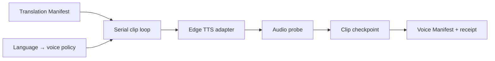

# Edge Voice Rendering Loop Design

## Observable result

Given one verified Translation Manifest and an explicit voice per target language, Voice Rendering synthesizes one audio clip per translated segment in deterministic order and publishes a hash-verified `voice-manifest.json` plus `voice-receipt.json`.

## Ownership and boundary

Voice Rendering owns selected voice IDs, synthesized clips, measured durations and clip checkpoints. Translation remains the sole owner of wording and timing. The capability does not clone a voice, edit text, stretch audio, mix the source, burn subtitles or publish video.

## Capability DAG

## Invariants

- Work order is Translation Manifest order, then segment ID.
- At most one synthesis call is active.
- Every clip binds translation SHA-256, language, media ID, segment ID, translated-text SHA-256 and voice ID.
- A completed checkpoint is reusable only while the clip bytes and all bindings still match.
- Same operation/input replays; changed voice/model/input conflicts.
- Missing voice policy, empty/corrupt audio or synthesis failure prevents a complete manifest.

## Adapter and evidence

The first production adapter invokes installed `edge-tts` and probes output with FFprobe. Domain tests use a deterministic file-writing fake. A live adapter run proves service interoperability, not voice quality, availability guarantees or cloning.
