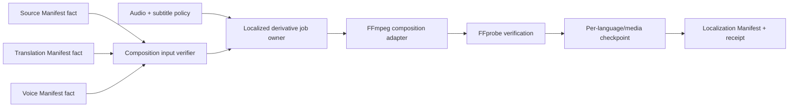

# Localized Video Composition Design

## Decision summary

Three boundaries were considered:

1. **Rebuild the public `localization` boundary around committed manifests (selected).** This keeps the product term users already see, replaces its launcher with a small `localization_app`, and leaves old `localizer` modules as compatibility code only.
2. Add a fourteenth `video-composition` app. This would be clean internally but would duplicate the existing Localization product boundary and repeat the redundancy the project is removing.
3. Import the old `localizer` package. This is rejected because it couples new Graph workflows to project-specific batch state, Qwen-era assumptions, and Russian-only paths.

The user previously authorized autonomous design decisions, so this written design is the approval boundary for implementation.

## Independent capability proof

| Field | Answer |
| --- | --- |
| Result | Exact Source, Translation and Voice manifests produce one inspectable localized MP4 per `(target language, media ID)`, plus a localization manifest and durable receipt. |
| Owner | Localization alone owns mix/subtitle policy, FFmpeg derivative execution, final video fingerprints and composition checkpoints. |
| Invariants | Input manifests and every referenced artifact are hash-bound; coverage is exact; work is strictly serial; partial files are never published; same operation/input replays; changed input conflicts; completed derivatives survive later-item failure. |
| Public contract | CLI command consumes three manifest paths, operation ID and explicit audio/subtitle policy; adapter port receives one immutable composition job; committed facts are `localization-manifest.json` and `localization-receipt.json`. |
| Hard closure | Source media, Translation JSON/SRT, Voice Manifest clips, FFmpeg and FFprobe. |
| Substitutes | Domain tests use a deterministic composition adapter that writes a probe-shaped artifact; this proves process semantics, not codec/media behavior. |
| Decision gates | Source-audio separation, cloned-voice preference, commercial subtitle themes and per-platform encoding profiles remain separate policies. |
| Non-goals | Translation editing, voice synthesis/cloning, source discovery, creator enumeration, upload, vocal separation, mobile hosting and production scale. |

## Capability DAG

All three manifest dependencies are `hard` Facts. FFmpeg is an Adapter. Audio/subtitle settings are explicit Policies. A fake adapter is only a domain-test substitute.

## Input and coverage contract

The command requires Source, Translation and Voice manifests explicitly instead of discovering them through private directories. Their fingerprints and lineage must agree:

- Translation covers every declared source media ID for every selected target language.
- Voice references the exact Translation Manifest SHA-256.
- Every voice clip matches language, media ID and ordered translation segment ID.
- Source media, translation JSON/SRT and voice clips must still match their declared size/hash.

Work order follows Translation Manifest order: language-major, media-minor. Every work item receives its source video, one SRT, ordered voice clips, source timing windows and policy.

## Media policy v1

- Video: preserve source dimensions and frame rate; encode H.264/yuv420p with `libx264`, CRF 20 and `faststart`.
- Subtitles: burn translated SRT using a readable white `Arial` style with black outline and safe bottom margin. Paths are escaped for FFmpeg's subtitle filter.
- Voice: delay each clip to the translation segment start. When a clip exceeds its timing window, apply a bounded `atempo` chain so it fits; shorter clips keep natural speed.
- Source audio: mix at volume `0.12` under the voice track. This preserves ambience but does not claim vocal separation.
- Output audio: AAC 192 kbps, 48 kHz stereo. If source audio is absent, use only the delayed voice track.
- Verification: FFprobe must report non-zero duration, a video stream and an audio stream; the published file is hash- and size-bound.

## Loop, failure and recovery

The owner writes one identity directory and one temporary MP4 per work item. Only a successful adapter plus probe can atomically rename it to the public path. The receipt checkpoints each derivative immediately. Duplicate completed operations return the existing manifest without invoking FFmpeg. Failed items remain explicit; retry reuses verified completed items and starts at failed/missing work. A conflicting operation ID never overwrites prior state.

Cancellation remains Graph Studio's process responsibility: terminating FFmpeg leaves only a removable `.partial.mp4`; no completed fact is emitted. Cleanup removes the partial for the affected item and is safe to repeat.

## Evidence plan

- RED: a Source + Translation + Voice fixture cannot currently produce a public localized MP4 through `apps/localization/run.ps1`.
- Focused: lineage/coverage validation, filter graph timing, serial order, atomic output, failure/retry, replay/conflict and public CLI.
- Adjacent: consume the real Translation and Voice manifests already produced by previous capabilities.
- Platform: generate one real RU localized MP4, FFprobe codecs/duration/resolution/audio, and inspect at least one rendered frame.
- End to end: add `Folder+Dub` and `URL+Dub` Graph Studio workflows after independent platform evidence passes.

## Delivery boundary

Successful domain and real FFmpeg evidence can support `PLATFORM_INTEGRATED` for the named local composition path. It cannot support production, source-vocal removal, human translation quality, voice-cloning similarity, authenticated publication or every-platform readiness.
