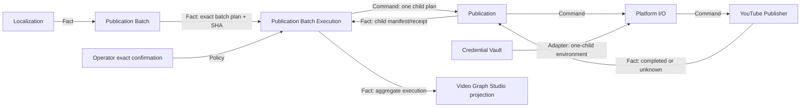

# Publication Batch Execution Design

## Observable result

Given one committed Publication Batch Plan, its exact SHA-256 confirmation and a Credential Vault path, a reusable local program executes every eligible child Publication plan strictly one at a time, resumes from verified checkpoints and commits one aggregate execution manifest. Video Graph Studio exposes the same owner as a separate `Release Execute` Graph. The current executable policy is credential-backed private YouTube only.

## Use cases

- `execute`: validate an immutable batch plan and confirmation, preflight every child, then command Publication once per derivative.
- `doctor`: report the supported policy, continuation mode and child owner without opening the Vault or contacting a platform.
- `verify`: independently verify the aggregate fact, child Publication manifests, external identities and exact input coverage.
- Browser admission: resolve a completed `folder-release` or `url-release` run from the same Studio state owner, require its committed batch-plan hash and admit a separate execution run.

## State-owner and invariant matrix

| State | Unique owner | Protected invariant | Public mutation | Public fact |
| --- | --- | --- | --- | --- |
| localized media | Localization | derivative bytes and language/media lineage match its manifest | Localization command | Localization Manifest |
| derivative publication intent | Publication Batch | every derivative has exact rendered metadata and child-plan coverage | `publication-batch plan` | Publication Batch Plan |
| one-video publication jobs | Publication | plan confirmation, serial job continuation and per-platform completion | `publication execute` | Publication Manifest/receipt |
| one YouTube upload attempt | YouTube Publisher | private visibility, stable credential-scoped identity, external ID or quarantined unknown outcome | `youtube-publisher upload` | redacted upload receipt |
| credential value and lifecycle | Credential Vault | provider match and one-child secret release | `credential-vault put/rotate/revoke/run` | redacted credential fact |
| batch execution continuation | Publication Batch Execution | one active child, exact aggregate confirmation, verified child reuse and complete aggregate coverage | `publication-batch-execution execute` | Publication Batch Execution Manifest/receipt |
| workflow lifecycle | Video Graph Studio | immutable Graph/run identity and durable node order | versioned run commands | run projection |

No owner reads or mutates another owner's private tables. Cross-owner dependencies are paths plus SHA-256 facts and public launcher calls.

## Relationships



## Capability DAG and build order

| Order | Capability result | Owner | Dependency | Classification | Current status |
| --- | --- | --- | --- | --- | --- |
| 1 | private YouTube upload returns an external ID or durable `UNKNOWN` | YouTube Publisher | fixed fake transport for domain tests | substitute | verified |
| 2 | credential-backed upload identity is isolated and `UNKNOWN` is preserved upward | Platform I/O + Publication adapters | YouTube Publisher fact | hard | lowest unproven |
| 3 | one batch plan is parsed and fully preflighted before side effects | Publication Batch Execution | Publication Batch Plan fact | hard | unproven |
| 4 | child Publication executions continue strictly serially and resumably | Publication Batch Execution | Publication public launcher | hard | unproven |
| 5 | aggregate execution fact has exact child/external-ID coverage | Publication Batch Execution | child Publication facts | hard | unproven |
| 6 | browser admits and projects a separate execution Graph | Video Graph Studio | verified batch execution owner | projection | unproven |
| 7 | real authenticated YouTube batch uploads | YouTube account | valid operator credential and selected real media | decision gate | pending explicit real-operation evidence |
| 8 | private/draft Bilibili, Douyin and TikTok execution | future platform adapters | proven visibility enforcement and reconciliation | decision gate | pending |

## Public contracts

### CLI

```powershell
.\apps\publication-batch-execution\run.ps1 execute C:\Jobs\publication-batch-plan.json `
  --confirmation <exact-batch-plan-sha256> `
  --credential-vault "$env:LOCALAPPDATA\VideoGraphStudio\credential-vault.json" `
  --output-dir C:\Jobs\publication-batch-execution `
  --operation-id release-execution-001 `
  --json
```

The receipt is `publication-batch-execution-receipt.json`; the success fact is `publication-batch-execution-manifest.json`.

### Input policy

Before any child process starts, the operation verifies:

- exact aggregate SHA-256 confirmation;
- aggregate schema, source Localization/metadata hashes and derivative ordering;
- every child plan path and hash;
- every child plan matches its derivative and rendered metadata;
- every job is `youtube`, `private-or-draft`, has a bounded credential ID and has an external-identity-capable execution path;
- the Vault path exists.

Any unsupported platform rejects the whole batch before the first upload.

### Continuation and identity

- The batch fingerprint includes the confirmed batch-plan SHA, resolved Vault path and adapter identity; changed input under the same operation ID conflicts.
- Stable child IDs derive from the parent operation ID, derivative ordinal and child-plan SHA.
- At most one Publication child is active.
- A completed child is reusable only when its receipt, manifest, child plan, derivative and external-ID coverage still match.
- Ordinary failures are checkpointed; later derivatives are attempted and a retry reruns only failed/stale children.
- `UNKNOWN` is never converted to ordinary failure. It is checkpointed as `UNKNOWN`, later children may proceed, and automatic replay of that child is fenced until a future reconciliation owner commits a terminal fact.
- The aggregate success manifest is withheld unless every child is verified `COMPLETED`.

## Enabling boundary hardening

Platform I/O accepts a bounded non-secret `executionScope` for credential-backed YouTube uploads and includes it in the child operation identity. Publication passes the job's Credential ID as this scope. This prevents two different Credential Vault records that share video, metadata and display-account text from reusing the same YouTube Publisher receipt.

Platform I/O also preserves the child `resultClass`. Publication records `UNKNOWN` without retrying, returns `UNKNOWN` on first uncertainty and `REJECTED_UNKNOWN` on automatic replay. Secret material, child stdout and child stderr remain absent from persisted parent facts.

## Failure handling

| Condition | Result |
| --- | --- |
| missing/invalid batch plan or Vault | `REJECTED_MALFORMED`, no child |
| confirmation mismatch or mutated child artifact | `REJECTED_CONFIRMATION` or `REJECTED_STALE`, no child |
| unsupported/non-private/uncredentialed job anywhere | `REJECTED_POLICY`, no child |
| same operation ID with changed fingerprint | `REJECTED_CONFLICT`, no child |
| ordinary child failure | item `FAILED`, continue, aggregate withheld |
| child upload outcome uncertain | item `UNKNOWN`, continue distinct children, automatic replay fenced |
| all child facts valid | `COMPLETED`, aggregate committed atomically |
| valid completed replay | `DUPLICATE_COMPLETED`, no child |

## Studio composition

`Release Execute` is a separate two-node Graph:

1. `execute-publication-batch`
2. `verify-publication-batch-execution`

Admission accepts only a completed `folder-release` or `url-release` run in the same RunStore whose `verify-publication-batch` node completed. The user supplies that run ID, the exact committed SHA-256 and a Vault path inside the current user's home. The Graph does not merge with `Folder+Release`; an upload-capable side effect always remains a separate confirmed command.

## Verification

- TDD RED tests for execution-scope identity and `UNKNOWN` propagation.
- Focused contracts for strict batch-plan parsing and preflight-before-side-effect behavior.
- Duplicate, conflict, stale, reentry, partial failure, unknown fencing and cleanup tests.
- Adjacent integration through the real Publication launcher, real Credential Vault and a fake Platform I/O boundary that proves one-secret-child injection without external contact.
- Studio admission, argv construction and independent aggregate verification tests.
- Real loopback browser/API smoke that creates but does not start a `Release Execute` run.
- Full repository test and manifest validation.

## Decision gates and non-goals

- No automatic public publication.
- No real upload is performed by automated evidence.
- No Bilibili, Douyin or TikTok execution until each adapter proves private/draft visibility and unknown-outcome reconciliation.
- No secret plaintext, hash or browser storage.
- No production, hosted, mobile, billing, scheduling or multi-tenant claim.
- Reconciliation of an already-unknown external upload is a later independent owner; this slice only fences it safely.
