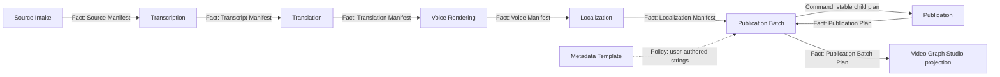

# Publication Batch Planning Design

Date: 2026-08-02
Status: approved from the user's standing authorization to choose the next vertical slice and continue without another approval prompt

## Observable result

A creator chooses a local folder or one supported social URL, target languages and voices, an editable metadata template, and one or more target platforms in Video Graph Studio. One recoverable Graph produces every localized derivative and then commits an inspectable private/draft publication plan for every derivative/platform pair.

No platform is contacted by this slice.

## Why this is the next slice

Folder and URL localization already process every media item in a Source Manifest, but Guarded Publication plans only one video at a time. Video Graph Studio therefore cannot yet fulfill its product promise that source, language, voice and platform choices belong to one recoverable workflow. The missing lowest owner is a reusable batch continuation process over the existing one-video Publication contract.

## Approaches considered

1. **Independent Publication Batch owner — selected.** Consume a committed Localization Manifest, render deterministic per-derivative metadata, invoke the public Publication launcher once per derivative, and aggregate verified plan facts. This preserves every existing state boundary and works from CLI, desktop, hosted API or a future mobile client.
2. **Expand Publication to accept batches.** This would mix one-video publication intent with cross-video progress and weaken the existing public contract.
3. **Loop inside Video Graph Studio.** This would make the browser control plane the hidden batch owner and prevent independent reuse.

## State-owner and invariant matrix

| Mutable state | Unique owner | Protected invariant | Public mutation | Public fact |
| --- | --- | --- | --- | --- |
| Localized derivative files and their lineage | Localization | exact language/media coverage and verified media fingerprints | Localization public launcher | Localization Manifest |
| One-video, multi-platform publication intent | Publication | deterministic plan identity, private/draft default, idempotent plan replay | `publication/run.ps1 plan` | Publication Plan and Planning Receipt |
| Per-derivative continuation, rendered metadata and aggregate coverage | Publication Batch | strict derivative order, stable child IDs, hash-fenced resume, no secret persistence | `publication-batch/run.ps1 plan` | Publication Batch Plan and Batch Receipt |
| Graph/run/node lifecycle | Video Graph Studio | durable run identity, ordered committed facts and one active run | versioned Studio command | run and step projections |
| Credential plaintext | Credential Vault | provider binding, encrypted custody and one-child release | Vault public launcher | redacted credential description/receipt |

## Public contract

Command:

```powershell
.\apps\publication-batch\run.ps1 plan C:\Jobs\localization-manifest.json `
  --metadata-template C:\Jobs\metadata.json `
  --target youtube=primary `
  --target tiktok=brand `
  --credential youtube=youtube-main `
  --output-dir C:\Jobs\publication-batch `
  --operation-id release-plan-001 --json
```

The metadata document requires a non-empty `title`. `title`, optional `description`, and each string in optional `tags` may use exactly these literal tokens:

- `{media_id}`
- `{language}`
- `{filename}`

Unknown brace tokens are rejected. A template without tokens remains a valid deliberate shared value.

Outputs:

- `publication-batch-receipt.json`: operation identity, canonical input fingerprint, item checkpoints, result class and optional aggregate path/hash;
- `publication-batch-plan.json`: immutable input lineage, ordered derivative identities, rendered metadata paths/hashes, child plan paths/hashes and exact total job coverage;
- one rendered metadata JSON and one child Publication directory per derivative.

All schemas use `schemaVersion: 1` and reject missing or unexpected authoritative fields at their public load boundary.

## Capability DAG



Hard dependencies are the Localization Manifest's ordered, fingerprinted derivative facts and Publication's public one-video planning command. The metadata template is a user-authored fixed policy, not a new state owner. A fake Publication child adapter is permitted only in focused failure tests; adjacent evidence must call the real Publication owner.

## Ordering and recovery

- Derivative order is exactly the order committed by Localization Manifest.
- A canonical child ID is derived from the parent operation ID plus derivative ordinal, language, media ID and derivative SHA-256.
- Maximum active batch items is one.
- A complete child is reused only when the derivative, rendered metadata and Publication Plan hashes still match.
- Same operation ID plus the same canonical fingerprint resumes the first incomplete or stale checkpoint.
- Same operation ID plus different Localization Manifest hash, metadata-template hash, targets or credential references returns `REJECTED_CONFLICT` without mutation.
- An item failure is checkpointed; later derivatives are attempted. Any failure makes the aggregate result `FAILED` and suppresses the aggregate plan until all items are complete.
- Temporary writes use same-directory atomic replacement. No child process remains after the command returns.

## Secret boundary

Targets may contain bounded credential IDs. They are non-secret references and flow into child Publication Plans. Publication Batch never reads Credential Vault and never accepts credential plaintext. Receipt, aggregate manifest, rendered metadata, logs and command-line arguments contain no secret value.

## Studio composition

Add `folder-release` and `url-release` Graphs. Each reuses the existing ten localization owner steps, then appends:

1. `plan-publication-batch`
2. `verify-publication-batch`

The Studio adapter consumes only the committed `localize` result and invokes the independent Publication Batch launcher. The verifier requires exact derivative order, exact target coverage, private/draft child jobs, child plan hashes, rendered metadata hashes and total job count. Browser controls expose the metadata-template path, platform/account selections and optional credential IDs only for Release workflows.

## Tests and evidence

Focused tests prove strict Localization Manifest validation, token rendering, ordering, duplicate/conflict/stale/reentry/partial-failure behavior, maximum concurrency one and secret exclusion. Adjacent integration creates real child Publication Plans through the public owner. Studio tests prove graph admission, adapter invocation and aggregate verification. A loopback browser/API smoke proves the Release workflow is selectable and its twelve owner steps and controls are usable.

The maximum supported level for this slice is `DOMAIN_VERIFIED` until a real folder or URL Release Graph produces multiple plans in the browser. Even that run would prove planning only, not platform upload.

## Decision gates

- Automatic public visibility remains unapproved and is not exposed.
- Automatic execution of an entire batch remains a later separately confirmed slice.
- Platform-specific title limits, hashtag rules, schedules and thumbnails require dedicated policy owners or adapters.

## Non-goals and forbidden claims

- No platform upload or authenticated external side effect.
- No claim that all four platforms can execute private/draft plans.
- No automatic public posting.
- No metadata quality or platform-policy certification.
- No hosted tenancy, billing, mobile shell, production scale or power-loss guarantee.
